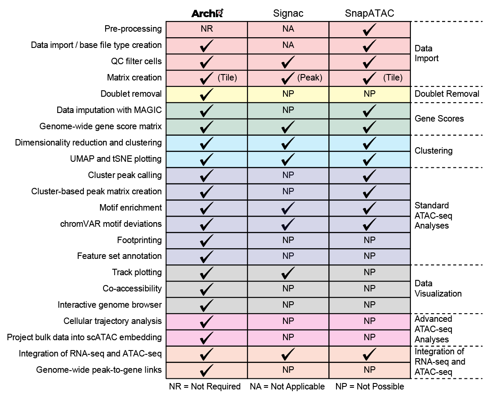

Last Updated: July 20, 2022

# Introduction

The challenge in analyzing scATACseq data lies with the nature of the data. It is extremely sparse and almost binary. For a diploid genome, each genomic site can be accessible on one allele, both alleles and no alleles. Many accessible regions are not transposed. The sparsity makes calling peaks very difficult. Many approaches have been developed to overcome this challenge. One approach is to group multiple regions together based on sequence similarity, such as binding motif, or k-mer, or co-activation pattern in DNaseq-seq data in ENCODE. This approach suffers from the loss of resolution. The second approach is to pool multiple cells together, which is used by cellranger-atac analysis pipeline and many other packages. However, this approach does not always solve the issue of sparsity, especially for rare cell types, and could underrepresent the rare cell types. The third approach works with the sparse matrix directly by turning the matrix into a binary accessibility matrix (SnapATAC, 5kb window size).

ArchR uses directly the sparse matrix and 500bp sliding window size to profile genome wide accessibility. It uses an optimized iterative latent semantic indexing (LSI) method for dimensionality reduction. ArchR is very efficient dealing with large datasets.



# Install ArchR and load hg38 genome data

## commands to install ArchR in R
### the peak calling package macs2 used by ArchR need some special handling and the one version of R that I have found to work is R 4.1.0

```{r eval=F, echo=T}
if (!requireNamespace("BiocManager", quietly = TRUE)){
    install.packages("BiocManager")
}

if (!requireNamespace("rtracklayer", quietly = TRUE)){
    install.packages("rtracklayer")
}

if (!requireNamespace("devtools", quietly = TRUE)){
    install.packages("devtools")
}

if (!requireNamespace("pheatmap", quietly = TRUE)){
    install.packages("pheatmap")
}

devtools::install_github("GreenleafLab/ArchR", ref="master", repos = BiocManager::repositories())

library(ArchR)
ArchR::installExtraPackages()

## For nice plot in ArchR, package Cairo is required, but it is not absolutely necessary. The installation of Cairo needs XQuartz (https://www.xquartz.org/) for MacOS.

if (!requireNamespace("Cairo", quietly = TRUE)){
    install.packages("Cairo")
}

## Install peak calling package macs2

if (!requireNamespace("remotes", quietly = TRUE)){
    install.packages("remotes")
}

## for motif analysis
if (!requireNamespace("chromVARmotifs", quietly = TRUE)){
    devtools::install_github("GreenleafLab/chromVARmotifs")
}


#remotes::install_github("RockefellerUniversity/Herper")
#library(Herper)
#if (!requireNamespace("hexbin", quietly = TRUE)){
#    install.packages("hexbin")
#}

#install_CondaTools(tools="macs2", env="PeakCalling_analysis", pathToMiniConda="./")
```

ArchR is not dependent on the package Cairo, which provides the way to rasterize plots. Without Cairo, the generated plots are vectorized and difficult to edit.

## Start ArchR and load the genome data

```{r echo=T, message=F, warning=F}
library(knitr)
library(pheatmap)
library(rtracklayer)
library(chromVARmotifs)
library(ArchR)
addArchRGenome("hg38")
```

There are pre-build genome data in ArchR: hg19, hg38, mm9 and mm10, but it supports the building of custom genomes.

## Read in scATAC data

```{r echo=T, message=F, warning=F}
inputs <- system("ls */outs/fragments.tsv.gz", intern=T)
names(inputs) <- sapply(inputs, function(x){strsplit(x, "/")[[1]][1]})
```


```{r echo=T, message=F, warning=F}
#ArrowFiles <- createArrowFiles(inputFiles = inputs, sampleNames = names(inputs),
#	filterTSS = 4, # filter based on TSS enrichment score
#	filterFrags = 1000, # filter based on the minimum fragments per cell
#	addTileMat = T, # 500bp sliding window counts matrix
#	addGeneScoreMat = T) # Gene-Score Matrix uses ATAC-Seq signal proximal to the TSS to estimate gene activity
ArrowFiles <- c("A001-C-007.arrow", "A001-C-104.arrow", "B001-A-301.arrow")
ArrowFiles
```

The above command create three Arrow files, one for each of our samples. An Arrow file is a hdf5 formatted file that is stored on harddrive. During the creataion of the Arrow files, ArchR does cell filtering based on the number of unique fragments, the signal-to-background ratio which is the ratio between the average accessibility within a 50-bp window around TSS as signal and the average accessibility flanking (+/- 1900-2000 bp) region. It also produce an assessment of the fragment size distribution to check the expected nucleosome periodicity.

Let's take a look at the TSS enrichment results and the fragment size distribution.

```{r echo =T, message=F, warning=F}
samples <- names(inputs)
```


```{r eval=F}
print(paste0("for sample: ", samples[1]))
knitr::include_graphics(file.path("QualityControl", samples[1], paste0(samples[1], "-Fragment_Size_Distribution.pdf")), file.path("QualityControl", samples[1], paste0(samples[1], "-TSS_by_Unique_Frag.pdf")), dpi=300)

print(paste0("for sample: ", samples[2]))
knitr::include_graphics(file.path("QualityControl", samples[1], paste0(samples[1], "-Fragment_Size_Distribution.pdf")), file.path("QualityControl", samples[1], paste0(samples[1], "-TSS_by_Unique_Frag.pdf")), dpi=300)


print(paste0("for sample: ", samples[3]))
knitr::include_graphics(file.path("QualityControl", samples[1], paste0(samples[1], "-Fragment_Size_Distribution.pdf")), file.path("QualityControl", samples[1], paste0(samples[1], "-TSS_by_Unique_Frag.pdf")), dpi=300)
```


## Doublet identification

in silico synthetic doublets are created by randomly selecting any two cells thousands of times and projects these doublets to the UMAP of our data. Then nearest neighbor to these synthetic doublets are identified to be potential doublets.

```{r error=T, message=F, warning=F}
double.score <- addDoubletScores(input = ArrowFiles,
                                 k = 10, # the number of nn to each synthetic doublet
                                 knnMethod="UMAP", # the embedding to use for knn search
                                 LSIMethod = 1, # TF-IDF normalization: 1. tf-logidf 2. log(tf-idf) 3. logtf-logidf
                                 verbose = T)
```

## Create an ArchRProject

```{r error=F, message=F, warning=F}
projatac <- ArchRProject(ArrowFiles = ArrowFiles, outputDirectory = "./scATAC_example", copyArrows = T)
projatac
```

Let's plot some summary plots

```{r summary.plot1, error=F, message=F, warning=F}
## plot fragment size distribution
plotFragmentSizes(ArchRProj = projatac)

## plot TSS enrichment
p1 <- plotGroups(
    ArchRProj = projatac, 
    groupBy = "Sample", 
    colorBy = "cellColData", 
    name = "TSSEnrichment",
    plotAs = "ridges"
   )
p1

p2 <- plotGroups(
    ArchRProj = projatac, 
    groupBy = "Sample", 
    colorBy = "cellColData", 
    name = "TSSEnrichment",
    plotAs = "violin",
    alpha = 0.4,
    addBoxPlot = TRUE
   )
p2

plotTSSEnrichment(ArchRProj = projatac)
```

## filter doublets

```{r error=F, message=F, warning=F}
projatac.filtered <- filterDoublets(projatac)
```

## Normalization and dimensionality reduction


```{r error=F, message=F, warning=F}
?addIterativeLSI
projatac.filtered <- addIterativeLSI(ArchRProj = projatac.filtered,
                                     useMatrix = "TileMatrix",
                                     name = "IterativeLSI",
                                     iterations = 2,
                                     clusterParams = list(resolution = c(0.2),
                                                          sampleCells = 5000,
                                                          n.start = 10),
                                     varFeatures = 25000,
                                     dimsToUse = 1:30)
```

## Clustering

ArchR uses Seurat's FindCluster() function to perform clustering.


```{r error=F, message=F, warning=F}
projatac.filtered <- addClusters(input = projatac.filtered,
                                 reduceDims = "IterativeLSI",
                                 method = "Seurat",
                                 name = "Clusters",
                                 resolution = 0.8)
```

Summary plot on the distribution of clusters

```{r error=F, warning=F, message=F}
cMatrix <- confusionMatrix(paste0(projatac.filtered$Clusters), paste0(projatac.filtered$Sample))
cMatrix <- cMatrix / Matrix::rowSums(cMatrix)
pheatmap::pheatmap(mat = cMatrix, color = paletteContinuous("blueYellow"), border_color = "black")
```


## Visualization of cells with respect to clusters

In order to visualize the cells in 2D, we have to project the high dimensional data to 2D.

```{r error=F, message=F, warning=F}
projatac.filtered <- addUMAP(ArchRProj = projatac.filtered, reducedDims = "IterativeLSI",
                             name = "UMAP", 
                             nNeighbors = 30, # number of nn to compute a UMAP
                             minDist = 0.5, # how tightly UMAP can pack points
                             metric = "cosine") # which distance to use, cosine for this type of data

## embedding slot is populated after the above step, please explore it
#str(projatac.filtered@embedding)

## plot the UMAP
plotEmbedding(ArchRProj = projatac.filtered, colorBy = "cellColData", name = "Sample", embedding = "UMAP")

## plot the UMAP, color by Clusters that were identified earlier
plotEmbedding(ArchRProj = projatac.filtered, colorBy = "cellColData", name = "Clusters", embedding = "UMAP")
```

ArchR provides tSNE plot feature as well, which is done using the function addTSNE(). Please explore the function and plot the data using tSNE.

## Gene Scores

ArchR uses a model to calculate gene activity score:

1. Accessibility within the gene body contributes to the gene score
2. An exponential weighting function that accounts for the activity of putative distal regulatory elements in a distance-dependent manner (e(-abs(distance)/5000) + e-1))
3. Imposed gene boundaries that minimizes the contribution of unrelated regulatory elements to the gene scores (100kb around the gene and not overlapping other genes)
4. Applies weights to adjust for gene size effect


Gene Scores can be created at the step of creating the ArrowFiles. And it can be added by using the function addGeneScoreMatrix().

```{r eval=F, error=F, message=F, warning=F}
?addGeneScoreMatrix
```

Using these Gene Scores, one can identify marker genes. For a cell cluster, ArchR creates a group of background cells by selecting the nearest neighbor cells across the multi-dimensional space that do not belong to the cell cluster. This enables a robust determination of significance even when the group of cells is small.

```{r error=F, message=F, warning=F}
GS.markers <- getMarkerFeatures(ArchRProj = projatac.filtered, useMatrix = "GeneScoreMatrix",
                                groupBy = "Clusters", bias = c("TSSEnrichment", "log10(nFrags)"),
                                testMethod = "wilcoxon")

## To get the markers
markers <- getMarkers(GS.markers, cutOff = "FDR <= 0.01 & Log2FC >= 1.25")

## We can visualize all of the markers in a heatmap and label some of genes of interest

marker.genes <- sample(unique(unlist(lapply(1:length(markers), function(x){markers[[names(markers)[x]]]$name[1:5]}))), 15)

heatmap.geneMK <- markerHeatmap(seMarker = GS.markers, cutOff = "FDR <= 0.01 & Log2FC >= 1.25",
                                labelMarkers = marker.genes, transpose = T)

ComplexHeatmap::draw(heatmap.geneMK, heatmap_legend_side = "bot",
                     annotation_legend_side = "bot")

```

We can overlay the marker genes on UMAP embedding.

```{r error=F, message=F, warning=F}
p <- plotEmbedding(ArchRProj = projatac.filtered, colorBy = "GeneScoreMatrix",
              name = marker.genes, embedding = "UMAP", quantCut = c(0.01, 0.95), imputeWeights = NULL)
p

## some fancy plotting of the same set of genes
p1 <- lapply(p, function(x){
  x + guides(color = F, fill = F) + theme_ArchR(baseSize = 6.5) +
    theme(plot.margin = unit(c(0,0,0,0), "cm")) +
    theme(axis.text.x=element_blank(),
          axis.ticks.x=element_blank(),
          axis.text.y=element_blank(),
          axis.ticks.y=element_blank())
})

do.call(cowplot::plot_grid, c(list(ncol=3), p1))
```

## We can visualize the chromatin accessibilities around these marker genes.

```{r error=F, warinig=F, message=F}
p2 <- plotBrowserTrack(ArchRProj = projatac.filtered, groupBy = "Clusters", geneSymbol = marker.genes,
                       upstream = 50000, downstream = 50000)

#grid::grid.newpage()
#grid.draw(p2$IKZF1)
plotPDF(plotList = p2, name = "marker-gene-tracks.pdf", ArchRProj = projatac.filtered,
        addDOC = F, width = 5, height = 5)
```


## Integrate with scRNASeq data

The gene scores calculated enables the integration between scATACSeq data and scRNASeq data. ArchR compares the gene scores matrix of the scATACSeq dataset to the gene expression matrix of the scRNASeq dataset and tries to align the cells.


```{r error=F, message=F, warning=F}
## load scRNASeq data
load("celltyped_seurat_object.RData")

## Integrate
projatac.filtered <- addGeneIntegrationMatrix(ArchRProj = projatac.filtered,
                                              useMatrix = "GeneScoreMatrix",
                                              matrixName = "GeneIntegrationMatrix",
                                              reducedDims = "IterativeLSI",
                                              seRNA = experiment.merged,
                                              addToArrow = F,
                                              groupRNA = "CellType",
                                              nameCell = "predictedCell",
                                              nameGroup = "predictedGroup",
                                              nameScore = "predictedScore")

## After this first round of integration, we can check how the clusters of scATAC data matches to the CellType of scRNA data.

integration.cMatrix <- as.matrix(confusionMatrix(projatac.filtered$Clusters, projatac.filtered$predictedGroup))
preClust <- colnames(integration.cMatrix)[apply(integration.cMatrix, 1, which.max)]
cbind(preClust, rownames(integration.cMatrix))

## CellType from scRNA
cEpi <- "Epithelial cells"
matched.types <- unique(projatac.filtered$predictedGroup)
cNon.Epi <- paste0(matched.types[!(matched.types %in% cEpi)], collapse="|")

## Assigned scATAC
assign.Epi <- rownames(integration.cMatrix)[grep(cEpi, preClust)]
assign.Non.Epi <- rownames(integration.cMatrix)[grep(cNon.Epi, preClust)]

## Identify cells from scRNA to each categories
rna.Epi <- colnames(experiment.merged)[grep(cEpi, experiment.merged$CellType)]
rna.Non.Epi <- colnames(experiment.merged)[grep(cNon.Epi, experiment.merged$CellType)]

## Create a nested list to match the celltypes from scRNA to scATAC
groupList <- SimpleList(
  Epithelial = SimpleList(
    ATAC = projatac.filtered$cellNames[projatac.filtered$Clusters %in% assign.Epi],
    RNA = rna.Epi
  ),
  Non.Epithelial = SimpleList(
    ATAC = projatac.filtered$cellNames[projatac.filtered$Clusters %in% assign.Non.Epi],
    RNA = rna.Non.Epi
  )
)

## We pass this list to the `groupList` parameter of the addGeneIntegrationMatrix` function

projatac.filtered <- addGeneIntegrationMatrix(
  ArchRProj = projatac.filtered,
  useMatrix = "GeneScoreMatrix",
  matrixName = "GeneIntegrationMatrix",
  reducedDims = "IterativeLSI",
  seRNA = experiment.merged,
  addToArrow = FALSE,
  groupList = groupList,
  groupRNA = "CellType",
  nameCell = "predictedCell_Constrain",
  nameGroup = "predictedGroup_Constrain",
  nameScore = "predictedScore_Constrain"
)
```


## Comparing the unconstrained and constrained integrations

```{r error=F, message=F, warning=F}
pal <- paletteDiscrete(values = experiment.merged$CellType)
pal

p3 <- plotEmbedding(
  projatac.filtered,
  colorBy = "cellColData",
  name = "predictedGroup",
  pal = pal
)

p4 <- plotEmbedding(
  projatac.filtered,
  colorBy = "cellColData",
  name = "predictedGroup_Constrain",
  pal = pal
)

plotPDF(p3, p4, name="plot-UMAP-RNA-Integration.pdf", ArchRProj=projatac.filtered, addDOC=F, width=5, height=5)
saveArchRProject(ArchRProj = projatac.filtered, outputDirectory="scATAC_example", load=F)
```


## Peak calling

ArchR use an iterative overlap scheme to form peaks. It also uses fixed width peaks. Variable width peaks makes it difficult to merge peak calls from multiple samples and makes the analysis more complicated because of the need to normalize to peak width.

 


Based on the nature of scATACSeq data, pseudo bulk data is generated by sampling cells. ArchR uses a complex decision tree to perform the pseudo bulk replicates generation.


## generating pseudo bulk replicates

```{r error=F, message=F, warning=F}
#loadArchRProject(path="./scATAC_peak")
#readRDS("scATAC_peak/Save-ArchR-Project.rds")
projatac.peak <- addGroupCoverages(ArchRProj = projatac.filtered, groupBy = "predictedGroup_Constrain")

#saveArchRProject(ArchRProj = projatac.peak, outputDirectory="scATAC_peak", load=T)
#saveArchRProject(ArchRProj = projatac.filtered, outputDirectory="scATAC_filtered", load=T)


#projatac.peak <- addReproduciblePeakSet(ArchRProj = projatac.peak,
#                                        groupBy = "predictedGroup_Constrain",
#                                        pathToMacs2 = path2macs2)

#projatac.peak <- addReproduciblePeakSet(ArchRProj = projatac.peak,
#                                        groupBy = "predictedGroup_Constrain",
#                                        peakMethod = "Tiles", method = "p")

peaks <- import("peaks.bed")
projatac.peak <- addPeakSet(ArchRProj = projatac.peak, peakSet = peaks, force=T)
projatac.peak <- addPeakMatrix(ArchRProj = projatac.peak)


## marker peaks
markersPeaks <- getMarkerFeatures(ArchRProj = projatac.peak,
                                  useMatrix = "PeakMatrix",
                                  groupBy = "predictedGroup_Constrain",
                                  bias = c("TSSEnrichment", "log10(nFrags)"),
                                  testMethod = "wilcoxon")

peak.markerList <- getMarkers(markersPeaks, cutOff = "FDR <= 0.01 & Log2FC >= 1")

heatmapPeaks <- markerHeatmap(
  seMarker = markersPeaks, 
  cutOff = "FDR <= 0.1 & Log2FC >= 0.5",
  transpose = TRUE
)

#draw(heatmapPeaks, heatmap_legend_side = "bot", annotation_legend_side = "bot")
plotPDF(heatmapPeaks, name = "Peak-Marker-Heatmap", width=8, height=6, ArchRProj=projatac.peak, addDOC=F)

peak.ma <- markerPlot(seMarker = markersPeaks, name = "Macrophages", cutOff="FDR <= 0.01 & Log2FC >= 1")
plotPDF(peak.ma, name = "Peak-MA", width=8, height=6, ArchRProj=projatac.peak, addDOC=F)
#saveArchRProject(ArchRProj = projatac.peak, outputDirectory="scATAC_peak", load=T)

peak.vc <- markerPlot(seMarker=markersPeaks, name = "Macrophages", cutOff="FDR <= 0.01 & Log2FC >= 1", plotAs="Volcano")
plotPDF(peak.vc, name="Peak-Volcano", width=8, height=6, ArchRProj=projatac.peak, addDOC=F)

peak.tracks <- plotBrowserTrack(
  ArchRProj = projatac.peak,
  groupBy = "predictedGroup_Constrain",
  geneSymbol = c("BMP4"),
  features = getMarkers(markersPeaks, cutOff="FDR <= 0.01 & Log2FC >= 1", returnGR = TRUE)["Macrophages"],
  upstream = 50000, downstream = 50000
)
plotPDF(peak.tracks, name="BMP4.markerpeak.track", width=5, height=5, ArchRProj=projatac.peak, addDOC=F)
```

## Peak testing between groups

```{r error=F, message=F, warning=F}
T.vs.Macro <- getMarkerFeatures(
  ArchRProj = projatac.peak,
  useMatrix = "PeakMatrix",
  groupBy = "predictedGroup_Constrain",
  testMethod = "wilcoxon",
  bias = c("TSSEnrichment", "log10(nFrags)"),
  useGroups = "T memory cells",
  bgdGroups = "Macrophages"
)
```

## Motif analysis

```{r error=F, warning=F, message=F}
## motif enrichment using Catalog of Inferred Sequence Binding Preferences database
projatac.peak <- addMotifAnnotations(ArchRProj=projatac.peak, motifSet="cisbp", name="Motif")

# Up regulated TF motif
motifsUp <- peakAnnoEnrichment(
  seMarker = T.vs.Macro,
  ArchRProj = projatac.peak,
  peakAnnotation = "Motif",
  cutOff = "FDR <= 0.1 & Log2FC >= 0.5"
)

# gather data for plotting
df <- data.frame(TF = rownames(motifsUp), mlog10Padj = assay(motifsUp)[,1])
df <- df[order(df$mlog10Padj, decreasing=TRUE),]
df$rank <- seq_len(nrow(df))

ggUp <- ggplot(df, aes(rank, mlog10Padj, color = mlog10Padj)) + 
  geom_point(size = 1) +
  ggrepel::geom_label_repel(
        data = df[rev(seq_len(30)), ], aes(x = rank, y = mlog10Padj, label = TF), 
        size = 1.5,
        nudge_x = 2,
        color = "black"
  ) + theme_ArchR() + 
  ylab("-log10(P-adj) Motif Enrichment") + 
  xlab("Rank Sorted TFs Enriched") +
  scale_color_gradientn(colors = paletteContinuous(set = "comet"))
plotPDF(ggUp, name="Up.Motif-enrichment", width=5, height=5, addDOC=F)

# Down regulated TF motif
motifsDn <- peakAnnoEnrichment(
    seMarker = T.vs.Macro,
    ArchRProj = projatac.peak,
    peakAnnotation = "Motif",
    cutOff = "FDR <= 0.1 & Log2FC <= -0.5"
  )

df <- data.frame(TF = rownames(motifsDn), mlog10Padj = assay(motifsDn)[,1])
df <- df[order(df$mlog10Padj, decreasing = TRUE),]
df$rank <- seq_len(nrow(df))

ggDn <- ggplot(df, aes(rank, mlog10Padj, color = mlog10Padj)) + 
  geom_point(size = 1) +
  ggrepel::geom_label_repel(
        data = df[rev(seq_len(30)), ], aes(x = rank, y = mlog10Padj, label = TF), 
        size = 1.5,
        nudge_x = 2,
        color = "black"
  ) + theme_ArchR() + 
  ylab("-log10(FDR) Motif Enrichment") +
  xlab("Rank Sorted TFs Enriched") +
  scale_color_gradientn(colors = paletteContinuous(set = "comet"))

plotPDF(ggDn, name="Down.Motif-enrichment", width=5, height=5, addDOC=F)


## Motifs enriched in marker peaks

motif.marker.Up <- peakAnnoEnrichment(
  seMarker = markersPeaks,
  ArchRProj = projatac.peak,
  peakAnnotation = "Motif",
  cutOff = "FDR <= 0.1 & Log2FC >= 0.5"
)

heatmap.markerEN <- plotEnrichHeatmap(motif.marker.Up, n = 5, transpose = TRUE)
plotPDF(heatmap.markerEN, name="MarkerPeak.Motif.Up", width=5, height=5, addDOC=F)

## Other enrichment

?addArchRAnnotations
```


## Session Information
```{r sessioinfo}
sessionInfo()
```
