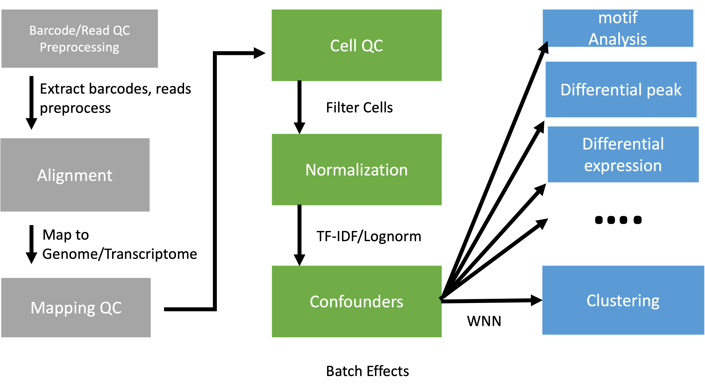
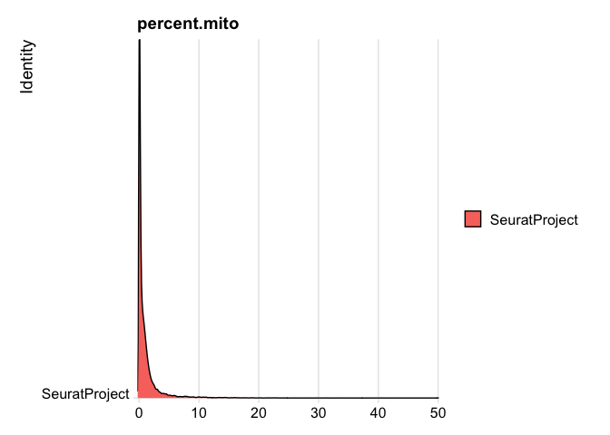
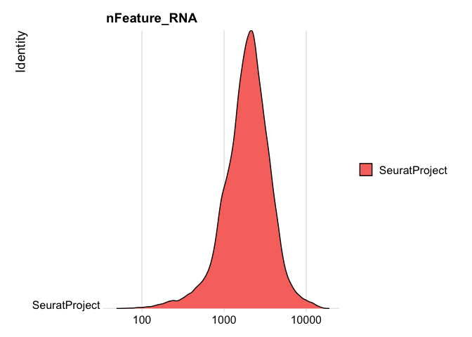

# Introduction

There are two types of single cell multiome (considering only gene expression and ATAC) experiments. One is to use single cell multiome kit from 10X and generate gene expression and ATAC libraries from the same cell. The other is to generate gene expression and ATAC libraries from different but same type of cells. The way to analyze these two types of multiome is different. We will start by looking at the experiments where the two sets of libraries are generated from the same cell. Then we will look at the second scenario. Both scenarios require that the scRNASeq data and scATACSeq data are processed separately first.


<p align="center">
   
</p>


# Install R packages and load the them for importing data to Seurat for QC


``` r
if (!requireNamespace("BiocManager", quietly = TRUE)){
    install.packages("BiocManager")
}

if (!requireNamespace("Seurat", quietly = TRUE)){
    install.packages("Seurat")
}

if (!requireNamespace("Signac", quietly = TRUE)){
    BiocManager::install("Signac")
}

if (!requireNamespace("devtools", quietly = TRUE)){
    install.packages("devtools")
}

if (!requireNamespace("SeuratData", quietly = TRUE)){
    devtools::install_github("SeuratData")
}

if (!requireNamespace("SeuratData", quietly = TRUE)){
    devtools::install_github("SeuratData")
}

if (!requireNamespace("DoubletFinder", quietly = TRUE)){
    devtools::install_github("chris-mcginnis-ucsf/DoubletFinder")
}

if (!requireNamespace("AnnotationHub", quietly = TRUE)){
    BiocManager::install("AnnotationHub")
}

if (!requireNamespace("HGNChelper", quietly = TRUE)){
    BiocManager::install("HGNChelper")
}

if (!requireNamespace("kableExtra", quietly = TRUE)){
    install.packages("kableExtra")
}


if (!requireNamespace("pheatmap", quietly = TRUE)){
    install.packages("pheatmap")
}

## for motif analysis
if (!requireNamespace("chromVAR", quietly = TRUE)){
    BiocManager::install("chromVAR")
}

if (!requireNamespace("BSgenome.Hsapiens.UCSC.hg38", quietly = TRUE)){
    BiocManager::install("BSgenome.Hsapiens.UCSC.hg38")
}

if (!requireNamespace("JASPAR2020", quietly = TRUE)){
    BiocManager::install("JASPAR2020")
}

if (!requireNamespace("motifmatchr", quietly = TRUE)){
    BiocManager::install("motifmatchr")
}


## for transcription factors analysis
if (!requireNamespace("TFBSTools", quietly = TRUE)){
    BiocManager::install("TFBSTools")
}
```


``` r
library(Seurat)
library(Signac)
library(DoubletFinder)
library(AnnotationHub)
```


## Read in scRNASeq data


``` r
d10x <- Read10X_h5("filtered_feature_bc_matrix.h5")
experiment.rna <- CreateSeuratObject(
	d10x$`Gene Expression`,
	min.cells = 0,
	min.features = 0)
```

### Create some QC metrics and plot


``` r
experiment.rna$percent.mito <- PercentageFeatureSet(experiment.rna, pattern = "^MT-")
RidgePlot(experiment.rna, features="percent.mito")
```

<!-- -->

``` r
RidgePlot(experiment.rna, features="nFeature_RNA", log=TRUE)
```

<!-- -->

``` r
RidgePlot(experiment.rna, features="nCount_RNA", log=TRUE)
```

<!-- -->

### Doublet removal


``` r
experiment.rna <- subset(experiment.rna, nFeature_RNA >= 400 & nFeature_RNA <= 5000)
experiment.rna <- subset(experiment.rna, nCount_RNA >= 1000 & nCount_RNA <= 12000)
experiment.rna <- NormalizeData(experiment.rna, normalization.method = "LogNormalize", scale.factor = 10000)
experiment.rna <- FindVariableFeatures(experiment.rna, selection.method = "vst", nfeatures = 2000)
experiment.rna <- ScaleData(experiment.rna)
experiment.rna <- RunPCA(experiment.rna)
sweep.res <- paramSweep(experiment.rna, PCs = 1:20, sct = FALSE)
```

```
## [1] "Creating artificial doublets for pN = 5%"
## [1] "Creating Seurat object..."
## [1] "Normalizing Seurat object..."
## [1] "Finding variable genes..."
## [1] "Scaling data..."
## [1] "Running PCA..."
## [1] "Calculating PC distance matrix..."
## [1] "Defining neighborhoods..."
## [1] "Computing pANN across all pK..."
## [1] "pK = 5e-04..."
## [1] "pK = 0.001..."
## [1] "pK = 0.005..."
## [1] "pK = 0.01..."
## [1] "pK = 0.02..."
## [1] "pK = 0.03..."
## [1] "pK = 0.04..."
## [1] "pK = 0.05..."
## [1] "pK = 0.06..."
## [1] "pK = 0.07..."
## [1] "pK = 0.08..."
## [1] "pK = 0.09..."
## [1] "pK = 0.1..."
## [1] "pK = 0.11..."
## [1] "pK = 0.12..."
## [1] "pK = 0.13..."
## [1] "pK = 0.14..."
## [1] "pK = 0.15..."
## [1] "pK = 0.16..."
## [1] "pK = 0.17..."
## [1] "pK = 0.18..."
## [1] "pK = 0.19..."
## [1] "pK = 0.2..."
## [1] "pK = 0.21..."
## [1] "pK = 0.22..."
## [1] "pK = 0.23..."
## [1] "pK = 0.24..."
## [1] "pK = 0.25..."
## [1] "pK = 0.26..."
## [1] "pK = 0.27..."
## [1] "pK = 0.28..."
## [1] "pK = 0.29..."
## [1] "pK = 0.3..."
## [1] "Creating artificial doublets for pN = 10%"
## [1] "Creating Seurat object..."
## [1] "Normalizing Seurat object..."
## [1] "Finding variable genes..."
## [1] "Scaling data..."
## [1] "Running PCA..."
## [1] "Calculating PC distance matrix..."
## [1] "Defining neighborhoods..."
## [1] "Computing pANN across all pK..."
## [1] "pK = 5e-04..."
## [1] "pK = 0.001..."
## [1] "pK = 0.005..."
## [1] "pK = 0.01..."
## [1] "pK = 0.02..."
## [1] "pK = 0.03..."
## [1] "pK = 0.04..."
## [1] "pK = 0.05..."
## [1] "pK = 0.06..."
## [1] "pK = 0.07..."
## [1] "pK = 0.08..."
## [1] "pK = 0.09..."
## [1] "pK = 0.1..."
## [1] "pK = 0.11..."
## [1] "pK = 0.12..."
## [1] "pK = 0.13..."
## [1] "pK = 0.14..."
## [1] "pK = 0.15..."
## [1] "pK = 0.16..."
## [1] "pK = 0.17..."
## [1] "pK = 0.18..."
## [1] "pK = 0.19..."
## [1] "pK = 0.2..."
## [1] "pK = 0.21..."
## [1] "pK = 0.22..."
## [1] "pK = 0.23..."
## [1] "pK = 0.24..."
## [1] "pK = 0.25..."
## [1] "pK = 0.26..."
## [1] "pK = 0.27..."
## [1] "pK = 0.28..."
## [1] "pK = 0.29..."
## [1] "pK = 0.3..."
## [1] "Creating artificial doublets for pN = 15%"
## [1] "Creating Seurat object..."
## [1] "Normalizing Seurat object..."
## [1] "Finding variable genes..."
## [1] "Scaling data..."
## [1] "Running PCA..."
## [1] "Calculating PC distance matrix..."
## [1] "Defining neighborhoods..."
## [1] "Computing pANN across all pK..."
## [1] "pK = 5e-04..."
## [1] "pK = 0.001..."
## [1] "pK = 0.005..."
## [1] "pK = 0.01..."
## [1] "pK = 0.02..."
## [1] "pK = 0.03..."
## [1] "pK = 0.04..."
## [1] "pK = 0.05..."
## [1] "pK = 0.06..."
## [1] "pK = 0.07..."
## [1] "pK = 0.08..."
## [1] "pK = 0.09..."
## [1] "pK = 0.1..."
## [1] "pK = 0.11..."
## [1] "pK = 0.12..."
## [1] "pK = 0.13..."
## [1] "pK = 0.14..."
## [1] "pK = 0.15..."
## [1] "pK = 0.16..."
## [1] "pK = 0.17..."
## [1] "pK = 0.18..."
## [1] "pK = 0.19..."
## [1] "pK = 0.2..."
## [1] "pK = 0.21..."
## [1] "pK = 0.22..."
## [1] "pK = 0.23..."
## [1] "pK = 0.24..."
## [1] "pK = 0.25..."
## [1] "pK = 0.26..."
## [1] "pK = 0.27..."
## [1] "pK = 0.28..."
## [1] "pK = 0.29..."
## [1] "pK = 0.3..."
## [1] "Creating artificial doublets for pN = 20%"
## [1] "Creating Seurat object..."
## [1] "Normalizing Seurat object..."
## [1] "Finding variable genes..."
## [1] "Scaling data..."
## [1] "Running PCA..."
## [1] "Calculating PC distance matrix..."
## [1] "Defining neighborhoods..."
## [1] "Computing pANN across all pK..."
## [1] "pK = 5e-04..."
## [1] "pK = 0.001..."
## [1] "pK = 0.005..."
## [1] "pK = 0.01..."
## [1] "pK = 0.02..."
## [1] "pK = 0.03..."
## [1] "pK = 0.04..."
## [1] "pK = 0.05..."
## [1] "pK = 0.06..."
## [1] "pK = 0.07..."
## [1] "pK = 0.08..."
## [1] "pK = 0.09..."
## [1] "pK = 0.1..."
## [1] "pK = 0.11..."
## [1] "pK = 0.12..."
## [1] "pK = 0.13..."
## [1] "pK = 0.14..."
## [1] "pK = 0.15..."
## [1] "pK = 0.16..."
## [1] "pK = 0.17..."
## [1] "pK = 0.18..."
## [1] "pK = 0.19..."
## [1] "pK = 0.2..."
## [1] "pK = 0.21..."
## [1] "pK = 0.22..."
## [1] "pK = 0.23..."
## [1] "pK = 0.24..."
## [1] "pK = 0.25..."
## [1] "pK = 0.26..."
## [1] "pK = 0.27..."
## [1] "pK = 0.28..."
## [1] "pK = 0.29..."
## [1] "pK = 0.3..."
## [1] "Creating artificial doublets for pN = 25%"
## [1] "Creating Seurat object..."
## [1] "Normalizing Seurat object..."
## [1] "Finding variable genes..."
## [1] "Scaling data..."
## [1] "Running PCA..."
## [1] "Calculating PC distance matrix..."
## [1] "Defining neighborhoods..."
## [1] "Computing pANN across all pK..."
## [1] "pK = 5e-04..."
## [1] "pK = 0.001..."
## [1] "pK = 0.005..."
## [1] "pK = 0.01..."
## [1] "pK = 0.02..."
## [1] "pK = 0.03..."
## [1] "pK = 0.04..."
## [1] "pK = 0.05..."
## [1] "pK = 0.06..."
## [1] "pK = 0.07..."
## [1] "pK = 0.08..."
## [1] "pK = 0.09..."
## [1] "pK = 0.1..."
## [1] "pK = 0.11..."
## [1] "pK = 0.12..."
## [1] "pK = 0.13..."
## [1] "pK = 0.14..."
## [1] "pK = 0.15..."
## [1] "pK = 0.16..."
## [1] "pK = 0.17..."
## [1] "pK = 0.18..."
## [1] "pK = 0.19..."
## [1] "pK = 0.2..."
## [1] "pK = 0.21..."
## [1] "pK = 0.22..."
## [1] "pK = 0.23..."
## [1] "pK = 0.24..."
## [1] "pK = 0.25..."
## [1] "pK = 0.26..."
## [1] "pK = 0.27..."
## [1] "pK = 0.28..."
## [1] "pK = 0.29..."
## [1] "pK = 0.3..."
## [1] "Creating artificial doublets for pN = 30%"
## [1] "Creating Seurat object..."
## [1] "Normalizing Seurat object..."
## [1] "Finding variable genes..."
## [1] "Scaling data..."
## [1] "Running PCA..."
## [1] "Calculating PC distance matrix..."
## [1] "Defining neighborhoods..."
## [1] "Computing pANN across all pK..."
## [1] "pK = 5e-04..."
## [1] "pK = 0.001..."
## [1] "pK = 0.005..."
## [1] "pK = 0.01..."
## [1] "pK = 0.02..."
## [1] "pK = 0.03..."
## [1] "pK = 0.04..."
## [1] "pK = 0.05..."
## [1] "pK = 0.06..."
## [1] "pK = 0.07..."
## [1] "pK = 0.08..."
## [1] "pK = 0.09..."
## [1] "pK = 0.1..."
## [1] "pK = 0.11..."
## [1] "pK = 0.12..."
## [1] "pK = 0.13..."
## [1] "pK = 0.14..."
## [1] "pK = 0.15..."
## [1] "pK = 0.16..."
## [1] "pK = 0.17..."
## [1] "pK = 0.18..."
## [1] "pK = 0.19..."
## [1] "pK = 0.2..."
## [1] "pK = 0.21..."
## [1] "pK = 0.22..."
## [1] "pK = 0.23..."
## [1] "pK = 0.24..."
## [1] "pK = 0.25..."
## [1] "pK = 0.26..."
## [1] "pK = 0.27..."
## [1] "pK = 0.28..."
## [1] "pK = 0.29..."
## [1] "pK = 0.3..."
```

``` r
sweep.stats <- summarizeSweep(sweep.res, GT = FALSE)
bcmvn <- find.pK(sweep.stats)
```

<!-- -->

```
## NULL
```

``` r
pK.set <- bcmvn$pK[which(bcmvn$BCmetric == max(bcmvn$BCmetric))]
nExp_poi <- round(0.08 * nrow(experiment.rna@meta.data))
experiment.rna <- doubletFinder(experiment.rna, PCs = 1:20, pN = 0.25, pK = as.numeric(as.character(pK.set)), nExp = nExp_poi, reuse.pANN = FALSE, sct = FALSE)
```

```
## [1] "Creating 6435 artificial doublets..."
## [1] "Creating Seurat object..."
## [1] "Normalizing Seurat object..."
## [1] "Finding variable genes..."
## [1] "Scaling data..."
## [1] "Running PCA..."
## [1] "Calculating PC distance matrix..."
## [1] "Computing pANN..."
## [1] "Classifying doublets.."
```

``` r
cls <- grep("DF.classifications", names(experiment.rna@meta.data))
```


