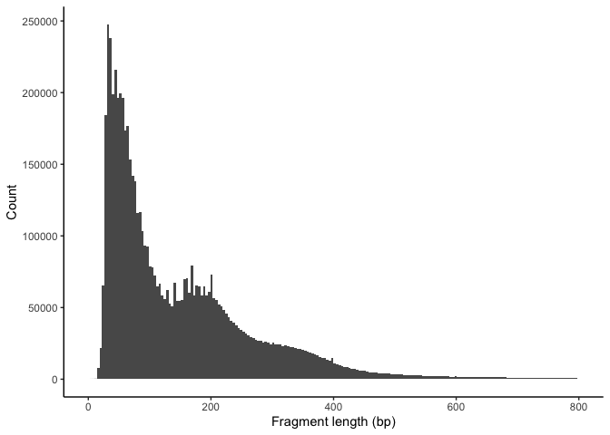
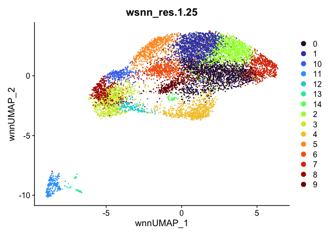

# Introduction

There are two types of single cell multiome (considering only gene expression and ATAC) experiments. One is to use single cell multiome kit from 10X and generate gene expression and ATAC libraries from the same cell. The other is to generate gene expression and ATAC libraries from different but same type of cells. The way to analyze these two types of multiome is different. We will start by looking at the experiments where the two sets of libraries are generated from the same cell. Then we will look at the second scenario. Both scenarios require that the scRNASeq data and scATACSeq data are qced separately first.


<p align="center">
   
</p>


# Install R packages and load the them for importing data to Seurat for QC


``` r
if (!requireNamespace("BiocManager", quietly = TRUE)){
    install.packages("BiocManager")
}

if (!requireNamespace("Seurat", quietly = TRUE)){
    install.packages("Seurat")
}

if (!requireNamespace("Signac", quietly = TRUE)){
    BiocManager::install("Signac")
}

if (!requireNamespace("devtools", quietly = TRUE)){
    install.packages("devtools")
}


if (!requireNamespace("SeuratData", quietly = TRUE)){
    devtools::install_github("SeuratData")
}

if (!requireNamespace("SoupX", quietly = TRUE)){
    install.packages("SoupX")
}

if (!requireNamespace("DoubletFinder", quietly = TRUE)){
    devtools::install_github("chris-mcginnis-ucsf/DoubletFinder")
}

if (!requireNamespace("AnnotationHub", quietly = TRUE)){
    BiocManager::install("AnnotationHub")
}

if (!requireNamespace("biovizBase", quietly = TRUE)){
    BiocManager::install("biovizBase")
}

if (!requireNamespace("HGNChelper", quietly = TRUE)){
    BiocManager::install("HGNChelper")
}

if (!requireNamespace("kableExtra", quietly = TRUE)){
    install.packages("kableExtra")
}

if (!requireNamespace("BSgenome.Hsapiens.UCSC.hg38", quietly = TRUE)){
    BiocManager::install("BSgenome.Hsapiens.UCSC.hg38")
}


## for motif analysis
if (!requireNamespace("chromVAR", quietly = TRUE)){
    BiocManager::install("chromVAR")
}


if (!requireNamespace("JASPAR2020", quietly = TRUE)){
    BiocManager::install("JASPAR2020")
}

## for transcription factors analysis
if (!requireNamespace("TFBSTools", quietly = TRUE)){
    BiocManager::install("TFBSTools")
}
```


``` r
library(Seurat)
library(DoubletFinder)
library(ggplot2)
```

# Processing scRNASeq and scATAC data separately

Read in cellranger output.


``` r
d10x <- Read10X_h5("cellranger_outs/filtered_feature_bc_matrix.h5")
```

## scRNASeq data processing

### Read in scRNASeq data


``` r
experiment.rna <- CreateSeuratObject(
	d10x$`Gene Expression`,
	min.cells = 0,
	min.features = 0)
```

### Create some QC metrics and plot


``` r
experiment.rna$percent.mito <- PercentageFeatureSet(experiment.rna, pattern = "^MT-")
RidgePlot(experiment.rna, features="percent.mito")
```

<!-- -->

``` r
RidgePlot(experiment.rna, features="nFeature_RNA", log=TRUE)
```

<!-- -->

``` r
RidgePlot(experiment.rna, features="nCount_RNA", log=TRUE)
```

<!-- -->

### Ambient RNA removal


``` r
library(SoupX)
dat <- Read10X_h5("cellranger_outs/raw_feature_bc_matrix.h5")$`Gene Expression`
datCells <- d10x$`Gene Expression`
dat <- dat[rownames(dat),]
clusters <- read.csv("cellranger_outs/analysis/clustering/gex/graphclust/clusters.csv")
mDat <- data.frame(clusters = clusters$Cluster, row.names = clusters$Barcode)
tsne <- read.csv("cellranger_outs/analysis/dimensionality_reduction/gex/tsne_projection.csv")
mDat$tSNE1 <- tsne$TSNE.1[match(rownames(mDat), tsne$Barcode)]
mDat$tSNE2 <- tsne$TSNE.2[match(rownames(mDat), tsne$Barcode)]
DR <- c("tSNE1", "tSNE2")
scdata <- SoupChannel(dat, datCells, mDat)
scdata <- autoEstCont(scdata)
```

<!-- -->

``` r
sccounts <- adjustCounts(scdata)
experiment.rna <- CreateSeuratObject(sccounts,
	min.cells = 0,
	min.features = 0)
experiment.rna$percent.mito <- PercentageFeatureSet(experiment.rna, pattern = "^MT-")
RidgePlot(experiment.rna, features="percent.mito")
```

<!-- -->

``` r
RidgePlot(experiment.rna, features="nFeature_RNA", log=TRUE) + geom_vline(xintercept = 8000)
```

<!-- -->

``` r
RidgePlot(experiment.rna, features="nCount_RNA", log=TRUE) + geom_vline(xintercept = 15000)
```

<!-- -->

### Doublet removal


``` r
experiment.rna <- subset(experiment.rna, nFeature_RNA >= 500 & nFeature_RNA <= 8000)
experiment.rna <- subset(experiment.rna, nCount_RNA >= 1000 & nCount_RNA <= 12000)
experiment.rna <- NormalizeData(experiment.rna, normalization.method = "LogNormalize", scale.factor = 10000)
experiment.rna <- FindVariableFeatures(experiment.rna, selection.method = "vst", nfeatures = 2000)
experiment.rna <- ScaleData(experiment.rna)
experiment.rna <- RunPCA(experiment.rna)
sweep.res <- paramSweep(experiment.rna, PCs = 1:20, sct = FALSE)
```

```
## [1] "Creating artificial doublets for pN = 5%"
## [1] "Creating Seurat object..."
## [1] "Normalizing Seurat object..."
## [1] "Finding variable genes..."
## [1] "Scaling data..."
## [1] "Running PCA..."
## [1] "Calculating PC distance matrix..."
## [1] "Defining neighborhoods..."
## [1] "Computing pANN across all pK..."
## [1] "pK = 5e-04..."
## [1] "pK = 0.001..."
## [1] "pK = 0.005..."
## [1] "pK = 0.01..."
## [1] "pK = 0.02..."
## [1] "pK = 0.03..."
## [1] "pK = 0.04..."
## [1] "pK = 0.05..."
## [1] "pK = 0.06..."
## [1] "pK = 0.07..."
## [1] "pK = 0.08..."
## [1] "pK = 0.09..."
## [1] "pK = 0.1..."
## [1] "pK = 0.11..."
## [1] "pK = 0.12..."
## [1] "pK = 0.13..."
## [1] "pK = 0.14..."
## [1] "pK = 0.15..."
## [1] "pK = 0.16..."
## [1] "pK = 0.17..."
## [1] "pK = 0.18..."
## [1] "pK = 0.19..."
## [1] "pK = 0.2..."
## [1] "pK = 0.21..."
## [1] "pK = 0.22..."
## [1] "pK = 0.23..."
## [1] "pK = 0.24..."
## [1] "pK = 0.25..."
## [1] "pK = 0.26..."
## [1] "pK = 0.27..."
## [1] "pK = 0.28..."
## [1] "pK = 0.29..."
## [1] "pK = 0.3..."
## [1] "Creating artificial doublets for pN = 10%"
## [1] "Creating Seurat object..."
## [1] "Normalizing Seurat object..."
## [1] "Finding variable genes..."
## [1] "Scaling data..."
## [1] "Running PCA..."
## [1] "Calculating PC distance matrix..."
## [1] "Defining neighborhoods..."
## [1] "Computing pANN across all pK..."
## [1] "pK = 5e-04..."
## [1] "pK = 0.001..."
## [1] "pK = 0.005..."
## [1] "pK = 0.01..."
## [1] "pK = 0.02..."
## [1] "pK = 0.03..."
## [1] "pK = 0.04..."
## [1] "pK = 0.05..."
## [1] "pK = 0.06..."
## [1] "pK = 0.07..."
## [1] "pK = 0.08..."
## [1] "pK = 0.09..."
## [1] "pK = 0.1..."
## [1] "pK = 0.11..."
## [1] "pK = 0.12..."
## [1] "pK = 0.13..."
## [1] "pK = 0.14..."
## [1] "pK = 0.15..."
## [1] "pK = 0.16..."
## [1] "pK = 0.17..."
## [1] "pK = 0.18..."
## [1] "pK = 0.19..."
## [1] "pK = 0.2..."
## [1] "pK = 0.21..."
## [1] "pK = 0.22..."
## [1] "pK = 0.23..."
## [1] "pK = 0.24..."
## [1] "pK = 0.25..."
## [1] "pK = 0.26..."
## [1] "pK = 0.27..."
## [1] "pK = 0.28..."
## [1] "pK = 0.29..."
## [1] "pK = 0.3..."
## [1] "Creating artificial doublets for pN = 15%"
## [1] "Creating Seurat object..."
## [1] "Normalizing Seurat object..."
## [1] "Finding variable genes..."
## [1] "Scaling data..."
## [1] "Running PCA..."
## [1] "Calculating PC distance matrix..."
## [1] "Defining neighborhoods..."
## [1] "Computing pANN across all pK..."
## [1] "pK = 5e-04..."
## [1] "pK = 0.001..."
## [1] "pK = 0.005..."
## [1] "pK = 0.01..."
## [1] "pK = 0.02..."
## [1] "pK = 0.03..."
## [1] "pK = 0.04..."
## [1] "pK = 0.05..."
## [1] "pK = 0.06..."
## [1] "pK = 0.07..."
## [1] "pK = 0.08..."
## [1] "pK = 0.09..."
## [1] "pK = 0.1..."
## [1] "pK = 0.11..."
## [1] "pK = 0.12..."
## [1] "pK = 0.13..."
## [1] "pK = 0.14..."
## [1] "pK = 0.15..."
## [1] "pK = 0.16..."
## [1] "pK = 0.17..."
## [1] "pK = 0.18..."
## [1] "pK = 0.19..."
## [1] "pK = 0.2..."
## [1] "pK = 0.21..."
## [1] "pK = 0.22..."
## [1] "pK = 0.23..."
## [1] "pK = 0.24..."
## [1] "pK = 0.25..."
## [1] "pK = 0.26..."
## [1] "pK = 0.27..."
## [1] "pK = 0.28..."
## [1] "pK = 0.29..."
## [1] "pK = 0.3..."
## [1] "Creating artificial doublets for pN = 20%"
## [1] "Creating Seurat object..."
## [1] "Normalizing Seurat object..."
## [1] "Finding variable genes..."
## [1] "Scaling data..."
## [1] "Running PCA..."
## [1] "Calculating PC distance matrix..."
## [1] "Defining neighborhoods..."
## [1] "Computing pANN across all pK..."
## [1] "pK = 5e-04..."
## [1] "pK = 0.001..."
## [1] "pK = 0.005..."
## [1] "pK = 0.01..."
## [1] "pK = 0.02..."
## [1] "pK = 0.03..."
## [1] "pK = 0.04..."
## [1] "pK = 0.05..."
## [1] "pK = 0.06..."
## [1] "pK = 0.07..."
## [1] "pK = 0.08..."
## [1] "pK = 0.09..."
## [1] "pK = 0.1..."
## [1] "pK = 0.11..."
## [1] "pK = 0.12..."
## [1] "pK = 0.13..."
## [1] "pK = 0.14..."
## [1] "pK = 0.15..."
## [1] "pK = 0.16..."
## [1] "pK = 0.17..."
## [1] "pK = 0.18..."
## [1] "pK = 0.19..."
## [1] "pK = 0.2..."
## [1] "pK = 0.21..."
## [1] "pK = 0.22..."
## [1] "pK = 0.23..."
## [1] "pK = 0.24..."
## [1] "pK = 0.25..."
## [1] "pK = 0.26..."
## [1] "pK = 0.27..."
## [1] "pK = 0.28..."
## [1] "pK = 0.29..."
## [1] "pK = 0.3..."
## [1] "Creating artificial doublets for pN = 25%"
## [1] "Creating Seurat object..."
## [1] "Normalizing Seurat object..."
## [1] "Finding variable genes..."
## [1] "Scaling data..."
## [1] "Running PCA..."
## [1] "Calculating PC distance matrix..."
## [1] "Defining neighborhoods..."
## [1] "Computing pANN across all pK..."
## [1] "pK = 5e-04..."
## [1] "pK = 0.001..."
## [1] "pK = 0.005..."
## [1] "pK = 0.01..."
## [1] "pK = 0.02..."
## [1] "pK = 0.03..."
## [1] "pK = 0.04..."
## [1] "pK = 0.05..."
## [1] "pK = 0.06..."
## [1] "pK = 0.07..."
## [1] "pK = 0.08..."
## [1] "pK = 0.09..."
## [1] "pK = 0.1..."
## [1] "pK = 0.11..."
## [1] "pK = 0.12..."
## [1] "pK = 0.13..."
## [1] "pK = 0.14..."
## [1] "pK = 0.15..."
## [1] "pK = 0.16..."
## [1] "pK = 0.17..."
## [1] "pK = 0.18..."
## [1] "pK = 0.19..."
## [1] "pK = 0.2..."
## [1] "pK = 0.21..."
## [1] "pK = 0.22..."
## [1] "pK = 0.23..."
## [1] "pK = 0.24..."
## [1] "pK = 0.25..."
## [1] "pK = 0.26..."
## [1] "pK = 0.27..."
## [1] "pK = 0.28..."
## [1] "pK = 0.29..."
## [1] "pK = 0.3..."
## [1] "Creating artificial doublets for pN = 30%"
## [1] "Creating Seurat object..."
## [1] "Normalizing Seurat object..."
## [1] "Finding variable genes..."
## [1] "Scaling data..."
## [1] "Running PCA..."
## [1] "Calculating PC distance matrix..."
## [1] "Defining neighborhoods..."
## [1] "Computing pANN across all pK..."
## [1] "pK = 5e-04..."
## [1] "pK = 0.001..."
## [1] "pK = 0.005..."
## [1] "pK = 0.01..."
## [1] "pK = 0.02..."
## [1] "pK = 0.03..."
## [1] "pK = 0.04..."
## [1] "pK = 0.05..."
## [1] "pK = 0.06..."
## [1] "pK = 0.07..."
## [1] "pK = 0.08..."
## [1] "pK = 0.09..."
## [1] "pK = 0.1..."
## [1] "pK = 0.11..."
## [1] "pK = 0.12..."
## [1] "pK = 0.13..."
## [1] "pK = 0.14..."
## [1] "pK = 0.15..."
## [1] "pK = 0.16..."
## [1] "pK = 0.17..."
## [1] "pK = 0.18..."
## [1] "pK = 0.19..."
## [1] "pK = 0.2..."
## [1] "pK = 0.21..."
## [1] "pK = 0.22..."
## [1] "pK = 0.23..."
## [1] "pK = 0.24..."
## [1] "pK = 0.25..."
## [1] "pK = 0.26..."
## [1] "pK = 0.27..."
## [1] "pK = 0.28..."
## [1] "pK = 0.29..."
## [1] "pK = 0.3..."
```

``` r
sweep.stats <- summarizeSweep(sweep.res, GT = FALSE)
bcmvn <- find.pK(sweep.stats)
```

<!-- -->

```
## NULL
```

``` r
pK.set <- bcmvn$pK[which(bcmvn$BCmetric == max(bcmvn$BCmetric))]
nExp_poi <- round(0.08 * nrow(experiment.rna@meta.data))
experiment.rna <- doubletFinder(experiment.rna, PCs = 1:20, pN = 0.25, pK = as.numeric(as.character(pK.set)), nExp = nExp_poi, reuse.pANN = FALSE, sct = FALSE)
```

```
## [1] "Creating 6440 artificial doublets..."
## [1] "Creating Seurat object..."
## [1] "Normalizing Seurat object..."
## [1] "Finding variable genes..."
## [1] "Scaling data..."
## [1] "Running PCA..."
## [1] "Calculating PC distance matrix..."
## [1] "Computing pANN..."
## [1] "Classifying doublets.."
```

``` r
cls <- grep("DF.classifications", names(experiment.rna@meta.data))
counts <- sccounts[, match(colnames(experiment.rna)[experiment.rna@meta.data[cls]=="Singlet"], colnames(sccounts))]
```

### Standard scRNASeq data processing


``` r
experiment.aggregate <- CreateSeuratObject(counts)
experiment.aggregate <- NormalizeData(experiment.aggregate, normalization.method = "LogNormalize", scale.factor = 10000)

s.genes <- cc.genes.updated.2019$s.genes
g2m.genes <- cc.genes.updated.2019$g2m.genes

experiment.aggregate <- CellCycleScoring(experiment.aggregate,
                                         s.features = s.genes,
                                         g2m.features = g2m.genes,
                                         set.ident = TRUE)

experiment.aggregate <- ScaleData(experiment.aggregate,
                                  vars.to.regress = c("S.Score", "G2M.Score", "nFeature_RNA"))

saveRDS(experiment.aggregate, "scrna.rds")
```

## scATACSeq data processing


``` r
library(AnnotationHub)
ah <- AnnotationHub()
qr <- query(ah, c("Homo sapiens", "EnsDb", "GRCh38"))
edb <- qr[[1]]
library(Signac)
library(biovizBase)

atac_counts <- d10x$Peaks
grange.counts <- StringToGRanges(rownames(atac_counts), sep=c(":", "-"))
grange.use <- seqnames(grange.counts) %in% standardChromosomes(grange.counts)
atac_counts <- atac_counts[as.vector(grange.use),]
annotations <- GetGRangesFromEnsDb(ensdb = edb)
seqlevelsStyle(annotations) <- 'UCSC'
genome(annotations) <- "GRCh38"

atac_assay <- CreateChromatinAssay(
        counts = atac_counts, sep = c(":", "-"), genome = "GRCh38",
        fragments = "./cellranger_outs/atac_fragments.tsv.gz",
        annotation = annotations)

## remove the cells that have been filtered out in scRNA data
experiment.aggregate <- readRDS("scrna.rds")
atac_assay <- subset(atac_assay, cells = colnames(experiment.aggregate))

experiment.atac <- CreateSeuratObject(
	atac_assay,
	assay = "ATAC")
```

### QC metrics and plots


``` r
## When individual sample per_barcode_metrics.csv is available, the following metrics can be calculated
#experiment.atac$pct_reads_in_peaks <- experiment.atac$atac_peak_region_fragments / experiment.atac$atac_fragments * 100
## blacklist regions created by ENCODE project
experiment.atac$blacklist_ratio <- FractionCountsInRegion(
        object = experiment.atac,
        assay = 'ATAC',
        regions = blacklist_hg38_unified
        )

experiment.atac <- TSSEnrichment(object = experiment.atac, fast = FALSE)

## scatter plot to easily identify filtering criteria
DensityScatter(experiment.atac, x = 'nCount_ATAC', y = 'TSS.enrichment', log_x = T, quantiles = T)
```

<!-- -->

``` r
d2p <- data.frame(nCount_ATAC = experiment.atac$nCount_ATAC, TSS.enrichment = experiment.atac$TSS.enrichment)
ggplot(d2p, aes(x = nCount_ATAC, y = TSS.enrichment)) + geom_point(size = 0.1) + coord_trans(x = "log10")
```

<!-- -->

``` r
## TSS enrichment plot
experiment.atac$high.tss <- ifelse(experiment.atac$TSS.enrichment > 3, 'High', 'Low')
TSSPlot(experiment.atac, group.by = 'high.tss') + NoLegend()
```

<!-- -->


``` r
## Nucleosome signal plot
experiment.atac <- NucleosomeSignal(object = experiment.atac, assay = "ATAC")

experiment.atac$nucleosome_group <- ifelse(experiment.atac$nucleosome_signal > 4, 'NS > 4', 'NS <= 4')
FragmentHistogram(object = experiment.atac, assay = "ATAC", group.by = NULL, region = "chr1-1-20000000")
```


<!-- -->

### scATAC QC filtering


``` r
experiment.atac <- subset(experiment.atac, subset = nCount_ATAC > 2300 & nCount_ATAC < 40000 & blacklist_ratio < 0.05 & nucleosome_signal < 4 & TSS.enrichment > 3)
saveRDS(experiment.atac, "scatac.rds")
```

## Analysis by combining scRNA and scATAC data before clustering


``` r
experiment.aggregate <- experiment.aggregate[, colnames(experiment.aggregate) %in% colnames(experiment.atac)]
atac_assay <- subset(atac_assay, cells = colnames(experiment.atac))
experiment.aggregate[["ATAC"]] <- atac_assay

VlnPlot(experiment.aggregate, features = c("nCount_ATAC", "nCount_RNA"), ncol = 3, log = T)
```

<!-- -->

### Performing dimensionality reduction on scRNA and scATAC data


``` r
## dimensionality reduction scRNA
DefaultAssay(experiment.aggregate) <- "RNA"
experiment.aggregate <- FindVariableFeatures(experiment.aggregate)
experiment.aggregate <- RunPCA(experiment.aggregate)
experiment.aggregate <- RunUMAP(experiment.aggregate,
                                reduction = "pca", reduction.name = "umap.rna", reduction.key = "rnaUMAP_",
                                dims = 1:30)


## dimensionality reduction scATAC
DefaultAssay(experiment.aggregate) <- "ATAC"
experiment.aggregate <- RunTFIDF(experiment.aggregate)
experiment.aggregate <- FindTopFeatures(experiment.aggregate, min.cutoff = 'q0')
experiment.aggregate <- RunSVD(experiment.aggregate)
experiment.aggregate <- RunUMAP(experiment.aggregate,
                                reduction = 'lsi',
                                dims = 2:50,
                                reduction.name = "umap.atac", reduction.key = "atacUMAP_")
saveRDS(experiment.aggregate, "bimodal.nomalized.rds")
```

### Clustering scRNA and scATAC data together using weighted nearest neighbor analysis

Weighted nearest neighbor analysis was introduced by the Satija Lab in [2021] (https://www.sciencedirect.com/science/article/pii/S0092867421005833?via%3Dihub). It is a framework to integrate multiple data types that are measured within a cell. It uses a unsupervised approach to learn the cell-specific "weights" for each modality, which will be used in downstream analysis. The workflow was designed to be robust to vast differences in data quality between different modalities and enable multiple downstream analyses using this integrated framework, such as visualization, clustering, trajectory analysis. The ultimate goal is to enable better characterization of cell states. The workflow involves four steps:

    1. Constructing independent k nearest neighbor graphs for both modalities
    2. Performing with and across-modality prediction
    3. Calculating cell-specific modality weights
    4. Calculating a WNN graph


``` r
experiment.aggregate <- readRDS("bimodal.nomalized.rds")
experiment.aggregate <- FindMultiModalNeighbors(experiment.aggregate, reduction.list = list("pca", "lsi"),
                                dims.list = list(1:30, 2:50))
experiment.aggregate <- FindClusters(experiment.aggregate, graph.name = "wsnn", resolution = seq(0.75, 1.5, 0.25), algorithm = 3, verbose = F)

experiment.aggregate <- RunUMAP(experiment.aggregate, nn.name = "weighted.nn",
                                reduction.name = "umap.wnn", reduction.key = "wnnUMAP_")
```

Let's take a look at the clusters.


``` r
outputs <- lapply(grep("wsnn", colnames(experiment.aggregate@meta.data), value=TRUE), function(res){
        dimplot <- DimPlot(experiment.aggregate, reduction = "umap.wnn", group.by = res, shuffle = TRUE) +
                scale_color_viridis_d(option = "turbo") + ggtitle(res)
        return(list(dimplot=dimplot))
})
```

``` r
for (i in 1:length(outputs)){
        cat("\n\n\n\n")
        print(outputs[[i]]$dimplot)
        cat("\n\n\n\n")
}
```


<!-- -->


<!-- -->


<!-- -->


<!-- -->

### Automatic cell type annotation using scRNA profile.


``` r
library(HGNChelper)
library(kableExtra)
source("https://raw.githubusercontent.com/IanevskiAleksandr/sc-type/master/R/gene_sets_prepare.R")
# load cell type annotation function
source("https://raw.githubusercontent.com/IanevskiAleksandr/sc-type/master/R/sctype_score_.R")

db = "https://raw.githubusercontent.com/IanevskiAleksandr/sc-type/master/ScTypeDB_full.xlsx"
tissues = "Kidney"

gs_list <- gene_sets_prepare(db, tissues)

# get the cell type marker genes' data
gene.features <- unique(unlist(c(gs_list)))
#scRNAseqData <- FetchData(experiment.aggregate, assay = "RNA", vars = rownames(experiment.aggregate[["RNA"]]))
scRNAseqData <- FetchData(experiment.aggregate, assay = "RNA", vars = gene.features, layer = "scale.data")
colnames(scRNAseqData) <- sapply(colnames(scRNAseqData), function(x){gsub("rna_", "", x)})
scRNAseqData <- t(scRNAseqData)

## cell type annotation
cy.max <- sctype_score(scRNAseqData, scaled = TRUE, gs = gs_list$gs_positive, gs2 = gs_list$gs_negative)

cC_results <- do.call(rbind, lapply(unique(experiment.aggregate@meta.data$wsnn_res.0.75), function(cluster){
        cy.max.cluster <- sort(rowSums(cy.max[,rownames(experiment.aggregate@meta.data[experiment.aggregate@meta.data$wsnn_res.0.75 == cluster, ])]), decreasing = TRUE)
        head(data.frame(cluster=cluster, type=names(cy.max.cluster), scores=cy.max.cluster, ncells=sum(experiment.aggregate@meta.data$wsnn_res.0.75 == cluster)), 10)
}))

sctype_scores <- cC_results %>% dplyr::group_by(cluster) %>% dplyr::slice_max(n=1, order_by=scores)
kable(sctype_scores[,1:3], caption="Initial Cell type assignment", "html") %>% kable_styling("striped")
```

<table class="table table-striped" style="margin-left: auto; margin-right: auto;">
<caption>Initial Cell type assignment</caption>
 <thead>
  <tr>
   <th style="text-align:left;"> cluster </th>
   <th style="text-align:left;"> type </th>
   <th style="text-align:right;"> scores </th>
  </tr>
 </thead>
<tbody>
  <tr>
   <td style="text-align:left;"> 0 </td>
   <td style="text-align:left;"> Principal cells (Collecting duct system) </td>
   <td style="text-align:right;"> 37.37502 </td>
  </tr>
  <tr>
   <td style="text-align:left;"> 1 </td>
   <td style="text-align:left;"> Proximal tubule cells </td>
   <td style="text-align:right;"> 194.42203 </td>
  </tr>
  <tr>
   <td style="text-align:left;"> 10 </td>
   <td style="text-align:left;"> Endothelial cells </td>
   <td style="text-align:right;"> 276.75519 </td>
  </tr>
  <tr>
   <td style="text-align:left;"> 11 </td>
   <td style="text-align:left;"> Ureteric Bud cells </td>
   <td style="text-align:right;"> 11.07892 </td>
  </tr>
  <tr>
   <td style="text-align:left;"> 2 </td>
   <td style="text-align:left;"> Loop of Henle cells </td>
   <td style="text-align:right;"> 918.87678 </td>
  </tr>
  <tr>
   <td style="text-align:left;"> 3 </td>
   <td style="text-align:left;"> Mesangial cells </td>
   <td style="text-align:right;"> 112.19081 </td>
  </tr>
  <tr>
   <td style="text-align:left;"> 4 </td>
   <td style="text-align:left;"> Proximal tubule cells </td>
   <td style="text-align:right;"> 1089.02504 </td>
  </tr>
  <tr>
   <td style="text-align:left;"> 5 </td>
   <td style="text-align:left;"> Cap mesenchyme cells (Mesenchymal cells) </td>
   <td style="text-align:right;"> 22.44973 </td>
  </tr>
  <tr>
   <td style="text-align:left;"> 6 </td>
   <td style="text-align:left;"> Podocytes </td>
   <td style="text-align:right;"> 74.47326 </td>
  </tr>
  <tr>
   <td style="text-align:left;"> 7 </td>
   <td style="text-align:left;"> Stromal cells </td>
   <td style="text-align:right;"> 156.93031 </td>
  </tr>
  <tr>
   <td style="text-align:left;"> 8 </td>
   <td style="text-align:left;"> Loop of Henle cells </td>
   <td style="text-align:right;"> 109.95110 </td>
  </tr>
  <tr>
   <td style="text-align:left;"> 9 </td>
   <td style="text-align:left;"> Hematopoietic cells </td>
   <td style="text-align:right;"> 803.16847 </td>
  </tr>
</tbody>
</table>

``` r
# set low sc-type score clusters to "unknown"
sctype_scores$type[as.numeric(as.character(sctype_scores$scores)) < sctype_scores$ncells/4] <- "Unknown"
kable(sctype_scores[,1:3], caption="Final Cell type assignment", "html") %>% kable_styling("striped")
```

<table class="table table-striped" style="margin-left: auto; margin-right: auto;">
<caption>Final Cell type assignment</caption>
 <thead>
  <tr>
   <th style="text-align:left;"> cluster </th>
   <th style="text-align:left;"> type </th>
   <th style="text-align:right;"> scores </th>
  </tr>
 </thead>
<tbody>
  <tr>
   <td style="text-align:left;"> 0 </td>
   <td style="text-align:left;"> Unknown </td>
   <td style="text-align:right;"> 37.37502 </td>
  </tr>
  <tr>
   <td style="text-align:left;"> 1 </td>
   <td style="text-align:left;"> Unknown </td>
   <td style="text-align:right;"> 194.42203 </td>
  </tr>
  <tr>
   <td style="text-align:left;"> 10 </td>
   <td style="text-align:left;"> Endothelial cells </td>
   <td style="text-align:right;"> 276.75519 </td>
  </tr>
  <tr>
   <td style="text-align:left;"> 11 </td>
   <td style="text-align:left;"> Unknown </td>
   <td style="text-align:right;"> 11.07892 </td>
  </tr>
  <tr>
   <td style="text-align:left;"> 2 </td>
   <td style="text-align:left;"> Loop of Henle cells </td>
   <td style="text-align:right;"> 918.87678 </td>
  </tr>
  <tr>
   <td style="text-align:left;"> 3 </td>
   <td style="text-align:left;"> Unknown </td>
   <td style="text-align:right;"> 112.19081 </td>
  </tr>
  <tr>
   <td style="text-align:left;"> 4 </td>
   <td style="text-align:left;"> Proximal tubule cells </td>
   <td style="text-align:right;"> 1089.02504 </td>
  </tr>
  <tr>
   <td style="text-align:left;"> 5 </td>
   <td style="text-align:left;"> Unknown </td>
   <td style="text-align:right;"> 22.44973 </td>
  </tr>
  <tr>
   <td style="text-align:left;"> 6 </td>
   <td style="text-align:left;"> Unknown </td>
   <td style="text-align:right;"> 74.47326 </td>
  </tr>
  <tr>
   <td style="text-align:left;"> 7 </td>
   <td style="text-align:left;"> Stromal cells </td>
   <td style="text-align:right;"> 156.93031 </td>
  </tr>
  <tr>
   <td style="text-align:left;"> 8 </td>
   <td style="text-align:left;"> Loop of Henle cells </td>
   <td style="text-align:right;"> 109.95110 </td>
  </tr>
  <tr>
   <td style="text-align:left;"> 9 </td>
   <td style="text-align:left;"> Hematopoietic cells </td>
   <td style="text-align:right;"> 803.16847 </td>
  </tr>
</tbody>
</table>

``` r
# label cells with cell type
experiment.aggregate@meta.data$CellType.wsnn_res.0.75 <- ""
for (i in unique(sctype_scores$cluster)){
        celltype <- sctype_scores[sctype_scores$cluster == i,]
        experiment.aggregate@meta.data$CellType.wsnn_res.0.75[experiment.aggregate@meta.data$wsnn_res.0.75 == i] <- as.character(celltype$type[1])
}
DimPlot(experiment.aggregate, reduction = "umap.wnn", label = TRUE, repel = TRUE, group.by = "CellType.wsnn_res.0.75", shuffle = TRUE) +
        scale_color_viridis_d(option = "turbo") + ggplot2::theme(legend.position="bottom", legend.text=element_text(size=8))
```

<!-- -->

``` r
p1 <- DimPlot(experiment.aggregate, reduction = "umap.rna", label = TRUE, repel = TRUE, group.by = "CellType.wsnn_res.0.75", shuffle = TRUE) +
        scale_color_viridis_d(option = "turbo") + NoLegend()


p2 <- DimPlot(experiment.aggregate, reduction = "umap.atac", label = TRUE, repel = TRUE, group.by = "CellType.wsnn_res.0.75", shuffle = TRUE) +
        scale_color_viridis_d(option = "turbo") + NoLegend()

p3 <- DimPlot(experiment.aggregate, reduction = "umap.wnn", label = TRUE, repel = TRUE, group.by = "CellType.wsnn_res.0.75", shuffle = TRUE) +
        scale_color_viridis_d(option = "turbo") + NoLegend()

p1 + p2 + p3
```

<!-- -->

### Find markers


``` r
Idents(experiment.aggregate) <- "CellType.wsnn_res.0.75"
DefaultAssay(experiment.aggregate) <- "RNA"
gene.markers <- FindMarkers(experiment.aggregate, ident.1 = "Hematopoietic cells", only.pos=FALSE, min.pct=0.25, logfc.threshold=0.25)
kable(gene.markers[1:100,], 'html', align='c') %>% kable_styling() %>% scroll_box(height="500px")
```

<div style="border: 1px solid #ddd; padding: 0px; overflow-y: scroll; height:500px; "><table class="table" style="margin-left: auto; margin-right: auto;">
 <thead>
  <tr>
   <th style="text-align:left;position: sticky; top:0; background-color: #FFFFFF;">   </th>
   <th style="text-align:center;position: sticky; top:0; background-color: #FFFFFF;"> p_val </th>
   <th style="text-align:center;position: sticky; top:0; background-color: #FFFFFF;"> avg_log2FC </th>
   <th style="text-align:center;position: sticky; top:0; background-color: #FFFFFF;"> pct.1 </th>
   <th style="text-align:center;position: sticky; top:0; background-color: #FFFFFF;"> pct.2 </th>
   <th style="text-align:center;position: sticky; top:0; background-color: #FFFFFF;"> p_val_adj </th>
  </tr>
 </thead>
<tbody>
  <tr>
   <td style="text-align:left;"> LDLRAD4 </td>
   <td style="text-align:center;"> 0 </td>
   <td style="text-align:center;"> 7.442599 </td>
   <td style="text-align:center;"> 0.811 </td>
   <td style="text-align:center;"> 0.019 </td>
   <td style="text-align:center;"> 0 </td>
  </tr>
  <tr>
   <td style="text-align:left;"> ARHGAP15 </td>
   <td style="text-align:center;"> 0 </td>
   <td style="text-align:center;"> 6.912135 </td>
   <td style="text-align:center;"> 0.758 </td>
   <td style="text-align:center;"> 0.011 </td>
   <td style="text-align:center;"> 0 </td>
  </tr>
  <tr>
   <td style="text-align:left;"> CELF2 </td>
   <td style="text-align:center;"> 0 </td>
   <td style="text-align:center;"> 5.702955 </td>
   <td style="text-align:center;"> 0.789 </td>
   <td style="text-align:center;"> 0.063 </td>
   <td style="text-align:center;"> 0 </td>
  </tr>
  <tr>
   <td style="text-align:left;"> KCNMA1 </td>
   <td style="text-align:center;"> 0 </td>
   <td style="text-align:center;"> 6.164893 </td>
   <td style="text-align:center;"> 0.775 </td>
   <td style="text-align:center;"> 0.067 </td>
   <td style="text-align:center;"> 0 </td>
  </tr>
  <tr>
   <td style="text-align:left;"> PTPRC </td>
   <td style="text-align:center;"> 0 </td>
   <td style="text-align:center;"> 6.241130 </td>
   <td style="text-align:center;"> 0.700 </td>
   <td style="text-align:center;"> 0.007 </td>
   <td style="text-align:center;"> 0 </td>
  </tr>
  <tr>
   <td style="text-align:left;"> MSR1 </td>
   <td style="text-align:center;"> 0 </td>
   <td style="text-align:center;"> 5.408020 </td>
   <td style="text-align:center;"> 0.762 </td>
   <td style="text-align:center;"> 0.073 </td>
   <td style="text-align:center;"> 0 </td>
  </tr>
  <tr>
   <td style="text-align:left;"> CHST11 </td>
   <td style="text-align:center;"> 0 </td>
   <td style="text-align:center;"> 5.490887 </td>
   <td style="text-align:center;"> 0.753 </td>
   <td style="text-align:center;"> 0.067 </td>
   <td style="text-align:center;"> 0 </td>
  </tr>
  <tr>
   <td style="text-align:left;"> TBXAS1 </td>
   <td style="text-align:center;"> 0 </td>
   <td style="text-align:center;"> 6.251135 </td>
   <td style="text-align:center;"> 0.700 </td>
   <td style="text-align:center;"> 0.034 </td>
   <td style="text-align:center;"> 0 </td>
  </tr>
  <tr>
   <td style="text-align:left;"> RGS1 </td>
   <td style="text-align:center;"> 0 </td>
   <td style="text-align:center;"> 9.519696 </td>
   <td style="text-align:center;"> 0.652 </td>
   <td style="text-align:center;"> 0.004 </td>
   <td style="text-align:center;"> 0 </td>
  </tr>
  <tr>
   <td style="text-align:left;"> PDE4B </td>
   <td style="text-align:center;"> 0 </td>
   <td style="text-align:center;"> 7.250954 </td>
   <td style="text-align:center;"> 0.648 </td>
   <td style="text-align:center;"> 0.011 </td>
   <td style="text-align:center;"> 0 </td>
  </tr>
  <tr>
   <td style="text-align:left;"> DOCK2 </td>
   <td style="text-align:center;"> 0 </td>
   <td style="text-align:center;"> 6.799417 </td>
   <td style="text-align:center;"> 0.648 </td>
   <td style="text-align:center;"> 0.011 </td>
   <td style="text-align:center;"> 0 </td>
  </tr>
  <tr>
   <td style="text-align:left;"> SLC1A3 </td>
   <td style="text-align:center;"> 0 </td>
   <td style="text-align:center;"> 11.397819 </td>
   <td style="text-align:center;"> 0.617 </td>
   <td style="text-align:center;"> 0.001 </td>
   <td style="text-align:center;"> 0 </td>
  </tr>
  <tr>
   <td style="text-align:left;"> LINC00278 </td>
   <td style="text-align:center;"> 0 </td>
   <td style="text-align:center;"> 9.322655 </td>
   <td style="text-align:center;"> 0.595 </td>
   <td style="text-align:center;"> 0.002 </td>
   <td style="text-align:center;"> 0 </td>
  </tr>
  <tr>
   <td style="text-align:left;"> CD74 </td>
   <td style="text-align:center;"> 0 </td>
   <td style="text-align:center;"> 6.448059 </td>
   <td style="text-align:center;"> 0.612 </td>
   <td style="text-align:center;"> 0.032 </td>
   <td style="text-align:center;"> 0 </td>
  </tr>
  <tr>
   <td style="text-align:left;"> PREX1 </td>
   <td style="text-align:center;"> 0 </td>
   <td style="text-align:center;"> 8.146827 </td>
   <td style="text-align:center;"> 0.581 </td>
   <td style="text-align:center;"> 0.003 </td>
   <td style="text-align:center;"> 0 </td>
  </tr>
  <tr>
   <td style="text-align:left;"> MEF2C </td>
   <td style="text-align:center;"> 0 </td>
   <td style="text-align:center;"> 6.563517 </td>
   <td style="text-align:center;"> 0.590 </td>
   <td style="text-align:center;"> 0.021 </td>
   <td style="text-align:center;"> 0 </td>
  </tr>
  <tr>
   <td style="text-align:left;"> INPP5D </td>
   <td style="text-align:center;"> 0 </td>
   <td style="text-align:center;"> 6.262607 </td>
   <td style="text-align:center;"> 0.581 </td>
   <td style="text-align:center;"> 0.019 </td>
   <td style="text-align:center;"> 0 </td>
  </tr>
  <tr>
   <td style="text-align:left;"> SRGN </td>
   <td style="text-align:center;"> 0 </td>
   <td style="text-align:center;"> 7.467014 </td>
   <td style="text-align:center;"> 0.564 </td>
   <td style="text-align:center;"> 0.012 </td>
   <td style="text-align:center;"> 0 </td>
  </tr>
  <tr>
   <td style="text-align:left;"> AOAH </td>
   <td style="text-align:center;"> 0 </td>
   <td style="text-align:center;"> 5.913373 </td>
   <td style="text-align:center;"> 0.568 </td>
   <td style="text-align:center;"> 0.023 </td>
   <td style="text-align:center;"> 0 </td>
  </tr>
  <tr>
   <td style="text-align:left;"> CIITA </td>
   <td style="text-align:center;"> 0 </td>
   <td style="text-align:center;"> 7.265145 </td>
   <td style="text-align:center;"> 0.551 </td>
   <td style="text-align:center;"> 0.010 </td>
   <td style="text-align:center;"> 0 </td>
  </tr>
  <tr>
   <td style="text-align:left;"> DOCK10 </td>
   <td style="text-align:center;"> 0 </td>
   <td style="text-align:center;"> 6.387843 </td>
   <td style="text-align:center;"> 0.546 </td>
   <td style="text-align:center;"> 0.008 </td>
   <td style="text-align:center;"> 0 </td>
  </tr>
  <tr>
   <td style="text-align:left;"> FYB1 </td>
   <td style="text-align:center;"> 0 </td>
   <td style="text-align:center;"> 7.361728 </td>
   <td style="text-align:center;"> 0.542 </td>
   <td style="text-align:center;"> 0.006 </td>
   <td style="text-align:center;"> 0 </td>
  </tr>
  <tr>
   <td style="text-align:left;"> FAM49A </td>
   <td style="text-align:center;"> 0 </td>
   <td style="text-align:center;"> 10.190762 </td>
   <td style="text-align:center;"> 0.533 </td>
   <td style="text-align:center;"> 0.002 </td>
   <td style="text-align:center;"> 0 </td>
  </tr>
  <tr>
   <td style="text-align:left;"> FKBP5 </td>
   <td style="text-align:center;"> 0 </td>
   <td style="text-align:center;"> 6.925745 </td>
   <td style="text-align:center;"> 0.542 </td>
   <td style="text-align:center;"> 0.011 </td>
   <td style="text-align:center;"> 0 </td>
  </tr>
  <tr>
   <td style="text-align:left;"> PIK3R5 </td>
   <td style="text-align:center;"> 0 </td>
   <td style="text-align:center;"> 8.019027 </td>
   <td style="text-align:center;"> 0.533 </td>
   <td style="text-align:center;"> 0.003 </td>
   <td style="text-align:center;"> 0 </td>
  </tr>
  <tr>
   <td style="text-align:left;"> GPNMB </td>
   <td style="text-align:center;"> 0 </td>
   <td style="text-align:center;"> 8.054225 </td>
   <td style="text-align:center;"> 0.529 </td>
   <td style="text-align:center;"> 0.008 </td>
   <td style="text-align:center;"> 0 </td>
  </tr>
  <tr>
   <td style="text-align:left;"> HLA-DRA </td>
   <td style="text-align:center;"> 0 </td>
   <td style="text-align:center;"> 6.439959 </td>
   <td style="text-align:center;"> 0.537 </td>
   <td style="text-align:center;"> 0.019 </td>
   <td style="text-align:center;"> 0 </td>
  </tr>
  <tr>
   <td style="text-align:left;"> UTY </td>
   <td style="text-align:center;"> 0 </td>
   <td style="text-align:center;"> 7.167129 </td>
   <td style="text-align:center;"> 0.502 </td>
   <td style="text-align:center;"> 0.004 </td>
   <td style="text-align:center;"> 0 </td>
  </tr>
  <tr>
   <td style="text-align:left;"> MS4A6A </td>
   <td style="text-align:center;"> 0 </td>
   <td style="text-align:center;"> 10.146818 </td>
   <td style="text-align:center;"> 0.489 </td>
   <td style="text-align:center;"> 0.001 </td>
   <td style="text-align:center;"> 0 </td>
  </tr>
  <tr>
   <td style="text-align:left;"> ZNF804A </td>
   <td style="text-align:center;"> 0 </td>
   <td style="text-align:center;"> 9.471391 </td>
   <td style="text-align:center;"> 0.489 </td>
   <td style="text-align:center;"> 0.003 </td>
   <td style="text-align:center;"> 0 </td>
  </tr>
  <tr>
   <td style="text-align:left;"> SAMSN1 </td>
   <td style="text-align:center;"> 0 </td>
   <td style="text-align:center;"> 7.210423 </td>
   <td style="text-align:center;"> 0.489 </td>
   <td style="text-align:center;"> 0.006 </td>
   <td style="text-align:center;"> 0 </td>
  </tr>
  <tr>
   <td style="text-align:left;"> ITGAX </td>
   <td style="text-align:center;"> 0 </td>
   <td style="text-align:center;"> 9.694704 </td>
   <td style="text-align:center;"> 0.480 </td>
   <td style="text-align:center;"> 0.002 </td>
   <td style="text-align:center;"> 0 </td>
  </tr>
  <tr>
   <td style="text-align:left;"> PDE3B </td>
   <td style="text-align:center;"> 0 </td>
   <td style="text-align:center;"> 6.789981 </td>
   <td style="text-align:center;"> 0.489 </td>
   <td style="text-align:center;"> 0.012 </td>
   <td style="text-align:center;"> 0 </td>
  </tr>
  <tr>
   <td style="text-align:left;"> KYNU </td>
   <td style="text-align:center;"> 0 </td>
   <td style="text-align:center;"> 9.478806 </td>
   <td style="text-align:center;"> 0.458 </td>
   <td style="text-align:center;"> 0.002 </td>
   <td style="text-align:center;"> 0 </td>
  </tr>
  <tr>
   <td style="text-align:left;"> L3MBTL4 </td>
   <td style="text-align:center;"> 0 </td>
   <td style="text-align:center;"> 6.425959 </td>
   <td style="text-align:center;"> 0.467 </td>
   <td style="text-align:center;"> 0.012 </td>
   <td style="text-align:center;"> 0 </td>
  </tr>
  <tr>
   <td style="text-align:left;"> FLI1 </td>
   <td style="text-align:center;"> 0 </td>
   <td style="text-align:center;"> 6.657869 </td>
   <td style="text-align:center;"> 0.454 </td>
   <td style="text-align:center;"> 0.004 </td>
   <td style="text-align:center;"> 0 </td>
  </tr>
  <tr>
   <td style="text-align:left;"> HLA-DPB1 </td>
   <td style="text-align:center;"> 0 </td>
   <td style="text-align:center;"> 6.458288 </td>
   <td style="text-align:center;"> 0.458 </td>
   <td style="text-align:center;"> 0.011 </td>
   <td style="text-align:center;"> 0 </td>
  </tr>
  <tr>
   <td style="text-align:left;"> TNFRSF1B </td>
   <td style="text-align:center;"> 0 </td>
   <td style="text-align:center;"> 7.553422 </td>
   <td style="text-align:center;"> 0.427 </td>
   <td style="text-align:center;"> 0.003 </td>
   <td style="text-align:center;"> 0 </td>
  </tr>
  <tr>
   <td style="text-align:left;"> IRAK3 </td>
   <td style="text-align:center;"> 0 </td>
   <td style="text-align:center;"> 9.589055 </td>
   <td style="text-align:center;"> 0.423 </td>
   <td style="text-align:center;"> 0.002 </td>
   <td style="text-align:center;"> 0 </td>
  </tr>
  <tr>
   <td style="text-align:left;"> MS4A7 </td>
   <td style="text-align:center;"> 0 </td>
   <td style="text-align:center;"> 8.738475 </td>
   <td style="text-align:center;"> 0.419 </td>
   <td style="text-align:center;"> 0.002 </td>
   <td style="text-align:center;"> 0 </td>
  </tr>
  <tr>
   <td style="text-align:left;"> CTSS </td>
   <td style="text-align:center;"> 0 </td>
   <td style="text-align:center;"> 6.250552 </td>
   <td style="text-align:center;"> 0.427 </td>
   <td style="text-align:center;"> 0.012 </td>
   <td style="text-align:center;"> 0 </td>
  </tr>
  <tr>
   <td style="text-align:left;"> PCED1B </td>
   <td style="text-align:center;"> 0 </td>
   <td style="text-align:center;"> 6.497238 </td>
   <td style="text-align:center;"> 0.419 </td>
   <td style="text-align:center;"> 0.007 </td>
   <td style="text-align:center;"> 0 </td>
  </tr>
  <tr>
   <td style="text-align:left;"> LINC01374 </td>
   <td style="text-align:center;"> 0 </td>
   <td style="text-align:center;"> 8.015152 </td>
   <td style="text-align:center;"> 0.410 </td>
   <td style="text-align:center;"> 0.004 </td>
   <td style="text-align:center;"> 0 </td>
  </tr>
  <tr>
   <td style="text-align:left;"> ST8SIA4 </td>
   <td style="text-align:center;"> 0 </td>
   <td style="text-align:center;"> 8.949004 </td>
   <td style="text-align:center;"> 0.401 </td>
   <td style="text-align:center;"> 0.002 </td>
   <td style="text-align:center;"> 0 </td>
  </tr>
  <tr>
   <td style="text-align:left;"> WDFY4 </td>
   <td style="text-align:center;"> 0 </td>
   <td style="text-align:center;"> 6.565779 </td>
   <td style="text-align:center;"> 0.396 </td>
   <td style="text-align:center;"> 0.009 </td>
   <td style="text-align:center;"> 0 </td>
  </tr>
  <tr>
   <td style="text-align:left;"> GAS7 </td>
   <td style="text-align:center;"> 0 </td>
   <td style="text-align:center;"> 7.346746 </td>
   <td style="text-align:center;"> 0.392 </td>
   <td style="text-align:center;"> 0.007 </td>
   <td style="text-align:center;"> 0 </td>
  </tr>
  <tr>
   <td style="text-align:left;"> HLA-DPA1 </td>
   <td style="text-align:center;"> 0 </td>
   <td style="text-align:center;"> 6.435030 </td>
   <td style="text-align:center;"> 0.392 </td>
   <td style="text-align:center;"> 0.010 </td>
   <td style="text-align:center;"> 0 </td>
  </tr>
  <tr>
   <td style="text-align:left;"> RTN1 </td>
   <td style="text-align:center;"> 0 </td>
   <td style="text-align:center;"> 6.821210 </td>
   <td style="text-align:center;"> 0.388 </td>
   <td style="text-align:center;"> 0.008 </td>
   <td style="text-align:center;"> 0 </td>
  </tr>
  <tr>
   <td style="text-align:left;"> CSF2RA </td>
   <td style="text-align:center;"> 0 </td>
   <td style="text-align:center;"> 8.394648 </td>
   <td style="text-align:center;"> 0.379 </td>
   <td style="text-align:center;"> 0.002 </td>
   <td style="text-align:center;"> 0 </td>
  </tr>
  <tr>
   <td style="text-align:left;"> LAPTM5 </td>
   <td style="text-align:center;"> 0 </td>
   <td style="text-align:center;"> 8.221312 </td>
   <td style="text-align:center;"> 0.379 </td>
   <td style="text-align:center;"> 0.003 </td>
   <td style="text-align:center;"> 0 </td>
  </tr>
  <tr>
   <td style="text-align:left;"> SLA </td>
   <td style="text-align:center;"> 0 </td>
   <td style="text-align:center;"> 6.567346 </td>
   <td style="text-align:center;"> 0.370 </td>
   <td style="text-align:center;"> 0.004 </td>
   <td style="text-align:center;"> 0 </td>
  </tr>
  <tr>
   <td style="text-align:left;"> MS4A4E </td>
   <td style="text-align:center;"> 0 </td>
   <td style="text-align:center;"> 8.817747 </td>
   <td style="text-align:center;"> 0.366 </td>
   <td style="text-align:center;"> 0.003 </td>
   <td style="text-align:center;"> 0 </td>
  </tr>
  <tr>
   <td style="text-align:left;"> BASP1 </td>
   <td style="text-align:center;"> 0 </td>
   <td style="text-align:center;"> 7.840451 </td>
   <td style="text-align:center;"> 0.366 </td>
   <td style="text-align:center;"> 0.004 </td>
   <td style="text-align:center;"> 0 </td>
  </tr>
  <tr>
   <td style="text-align:left;"> OLR1 </td>
   <td style="text-align:center;"> 0 </td>
   <td style="text-align:center;"> 11.184424 </td>
   <td style="text-align:center;"> 0.361 </td>
   <td style="text-align:center;"> 0.000 </td>
   <td style="text-align:center;"> 0 </td>
  </tr>
  <tr>
   <td style="text-align:left;"> NRP2 </td>
   <td style="text-align:center;"> 0 </td>
   <td style="text-align:center;"> 6.434487 </td>
   <td style="text-align:center;"> 0.366 </td>
   <td style="text-align:center;"> 0.010 </td>
   <td style="text-align:center;"> 0 </td>
  </tr>
  <tr>
   <td style="text-align:left;"> USP9Y </td>
   <td style="text-align:center;"> 0 </td>
   <td style="text-align:center;"> 6.561384 </td>
   <td style="text-align:center;"> 0.357 </td>
   <td style="text-align:center;"> 0.005 </td>
   <td style="text-align:center;"> 0 </td>
  </tr>
  <tr>
   <td style="text-align:left;"> IL10RA </td>
   <td style="text-align:center;"> 0 </td>
   <td style="text-align:center;"> 8.198665 </td>
   <td style="text-align:center;"> 0.348 </td>
   <td style="text-align:center;"> 0.001 </td>
   <td style="text-align:center;"> 0 </td>
  </tr>
  <tr>
   <td style="text-align:left;"> LCP2 </td>
   <td style="text-align:center;"> 0 </td>
   <td style="text-align:center;"> 6.538779 </td>
   <td style="text-align:center;"> 0.344 </td>
   <td style="text-align:center;"> 0.003 </td>
   <td style="text-align:center;"> 0 </td>
  </tr>
  <tr>
   <td style="text-align:left;"> SLC2A3 </td>
   <td style="text-align:center;"> 0 </td>
   <td style="text-align:center;"> 7.355856 </td>
   <td style="text-align:center;"> 0.348 </td>
   <td style="text-align:center;"> 0.007 </td>
   <td style="text-align:center;"> 0 </td>
  </tr>
  <tr>
   <td style="text-align:left;"> CD86 </td>
   <td style="text-align:center;"> 0 </td>
   <td style="text-align:center;"> 9.545345 </td>
   <td style="text-align:center;"> 0.339 </td>
   <td style="text-align:center;"> 0.001 </td>
   <td style="text-align:center;"> 0 </td>
  </tr>
  <tr>
   <td style="text-align:left;"> PADI2 </td>
   <td style="text-align:center;"> 0 </td>
   <td style="text-align:center;"> 9.938869 </td>
   <td style="text-align:center;"> 0.339 </td>
   <td style="text-align:center;"> 0.002 </td>
   <td style="text-align:center;"> 0 </td>
  </tr>
  <tr>
   <td style="text-align:left;"> FCGR2A </td>
   <td style="text-align:center;"> 0 </td>
   <td style="text-align:center;"> 8.769063 </td>
   <td style="text-align:center;"> 0.335 </td>
   <td style="text-align:center;"> 0.002 </td>
   <td style="text-align:center;"> 0 </td>
  </tr>
  <tr>
   <td style="text-align:left;"> CXCR4 </td>
   <td style="text-align:center;"> 0 </td>
   <td style="text-align:center;"> 6.483729 </td>
   <td style="text-align:center;"> 0.335 </td>
   <td style="text-align:center;"> 0.005 </td>
   <td style="text-align:center;"> 0 </td>
  </tr>
  <tr>
   <td style="text-align:left;"> C1QB </td>
   <td style="text-align:center;"> 0 </td>
   <td style="text-align:center;"> 6.346739 </td>
   <td style="text-align:center;"> 0.335 </td>
   <td style="text-align:center;"> 0.009 </td>
   <td style="text-align:center;"> 0 </td>
  </tr>
  <tr>
   <td style="text-align:left;"> SLC11A1 </td>
   <td style="text-align:center;"> 0 </td>
   <td style="text-align:center;"> 8.262644 </td>
   <td style="text-align:center;"> 0.330 </td>
   <td style="text-align:center;"> 0.004 </td>
   <td style="text-align:center;"> 0 </td>
  </tr>
  <tr>
   <td style="text-align:left;"> HCLS1 </td>
   <td style="text-align:center;"> 0 </td>
   <td style="text-align:center;"> 7.064875 </td>
   <td style="text-align:center;"> 0.330 </td>
   <td style="text-align:center;"> 0.004 </td>
   <td style="text-align:center;"> 0 </td>
  </tr>
  <tr>
   <td style="text-align:left;"> KLHL6 </td>
   <td style="text-align:center;"> 0 </td>
   <td style="text-align:center;"> 8.440148 </td>
   <td style="text-align:center;"> 0.322 </td>
   <td style="text-align:center;"> 0.003 </td>
   <td style="text-align:center;"> 0 </td>
  </tr>
  <tr>
   <td style="text-align:left;"> HLA-DQA1 </td>
   <td style="text-align:center;"> 0 </td>
   <td style="text-align:center;"> 6.924711 </td>
   <td style="text-align:center;"> 0.313 </td>
   <td style="text-align:center;"> 0.004 </td>
   <td style="text-align:center;"> 0 </td>
  </tr>
  <tr>
   <td style="text-align:left;"> CLEC7A </td>
   <td style="text-align:center;"> 0 </td>
   <td style="text-align:center;"> 9.390614 </td>
   <td style="text-align:center;"> 0.308 </td>
   <td style="text-align:center;"> 0.001 </td>
   <td style="text-align:center;"> 0 </td>
  </tr>
  <tr>
   <td style="text-align:left;"> MS4A4A </td>
   <td style="text-align:center;"> 0 </td>
   <td style="text-align:center;"> 7.887890 </td>
   <td style="text-align:center;"> 0.308 </td>
   <td style="text-align:center;"> 0.002 </td>
   <td style="text-align:center;"> 0 </td>
  </tr>
  <tr>
   <td style="text-align:left;"> AC079793.1 </td>
   <td style="text-align:center;"> 0 </td>
   <td style="text-align:center;"> 6.408098 </td>
   <td style="text-align:center;"> 0.308 </td>
   <td style="text-align:center;"> 0.004 </td>
   <td style="text-align:center;"> 0 </td>
  </tr>
  <tr>
   <td style="text-align:left;"> BCAT1 </td>
   <td style="text-align:center;"> 0 </td>
   <td style="text-align:center;"> 8.851881 </td>
   <td style="text-align:center;"> 0.304 </td>
   <td style="text-align:center;"> 0.002 </td>
   <td style="text-align:center;"> 0 </td>
  </tr>
  <tr>
   <td style="text-align:left;"> IKZF1 </td>
   <td style="text-align:center;"> 0 </td>
   <td style="text-align:center;"> 6.024952 </td>
   <td style="text-align:center;"> 0.304 </td>
   <td style="text-align:center;"> 0.004 </td>
   <td style="text-align:center;"> 0 </td>
  </tr>
  <tr>
   <td style="text-align:left;"> PECAM1 </td>
   <td style="text-align:center;"> 0 </td>
   <td style="text-align:center;"> 5.974864 </td>
   <td style="text-align:center;"> 0.304 </td>
   <td style="text-align:center;"> 0.006 </td>
   <td style="text-align:center;"> 0 </td>
  </tr>
  <tr>
   <td style="text-align:left;"> PALD1 </td>
   <td style="text-align:center;"> 0 </td>
   <td style="text-align:center;"> 7.607121 </td>
   <td style="text-align:center;"> 0.295 </td>
   <td style="text-align:center;"> 0.003 </td>
   <td style="text-align:center;"> 0 </td>
  </tr>
  <tr>
   <td style="text-align:left;"> HLA-DMB </td>
   <td style="text-align:center;"> 0 </td>
   <td style="text-align:center;"> 6.766732 </td>
   <td style="text-align:center;"> 0.291 </td>
   <td style="text-align:center;"> 0.005 </td>
   <td style="text-align:center;"> 0 </td>
  </tr>
  <tr>
   <td style="text-align:left;"> TRPM2 </td>
   <td style="text-align:center;"> 0 </td>
   <td style="text-align:center;"> 8.640227 </td>
   <td style="text-align:center;"> 0.286 </td>
   <td style="text-align:center;"> 0.001 </td>
   <td style="text-align:center;"> 0 </td>
  </tr>
  <tr>
   <td style="text-align:left;"> CSF1R </td>
   <td style="text-align:center;"> 0 </td>
   <td style="text-align:center;"> 7.629998 </td>
   <td style="text-align:center;"> 0.282 </td>
   <td style="text-align:center;"> 0.002 </td>
   <td style="text-align:center;"> 0 </td>
  </tr>
  <tr>
   <td style="text-align:left;"> RCSD1 </td>
   <td style="text-align:center;"> 0 </td>
   <td style="text-align:center;"> 7.598245 </td>
   <td style="text-align:center;"> 0.282 </td>
   <td style="text-align:center;"> 0.003 </td>
   <td style="text-align:center;"> 0 </td>
  </tr>
  <tr>
   <td style="text-align:left;"> TYROBP </td>
   <td style="text-align:center;"> 0 </td>
   <td style="text-align:center;"> 7.354642 </td>
   <td style="text-align:center;"> 0.282 </td>
   <td style="text-align:center;"> 0.004 </td>
   <td style="text-align:center;"> 0 </td>
  </tr>
  <tr>
   <td style="text-align:left;"> C22orf34 </td>
   <td style="text-align:center;"> 0 </td>
   <td style="text-align:center;"> 6.369845 </td>
   <td style="text-align:center;"> 0.278 </td>
   <td style="text-align:center;"> 0.003 </td>
   <td style="text-align:center;"> 0 </td>
  </tr>
  <tr>
   <td style="text-align:left;"> PARVG </td>
   <td style="text-align:center;"> 0 </td>
   <td style="text-align:center;"> 8.695069 </td>
   <td style="text-align:center;"> 0.269 </td>
   <td style="text-align:center;"> 0.001 </td>
   <td style="text-align:center;"> 0 </td>
  </tr>
  <tr>
   <td style="text-align:left;"> FPR3 </td>
   <td style="text-align:center;"> 0 </td>
   <td style="text-align:center;"> 8.742942 </td>
   <td style="text-align:center;"> 0.264 </td>
   <td style="text-align:center;"> 0.001 </td>
   <td style="text-align:center;"> 0 </td>
  </tr>
  <tr>
   <td style="text-align:left;"> CD84 </td>
   <td style="text-align:center;"> 0 </td>
   <td style="text-align:center;"> 7.591719 </td>
   <td style="text-align:center;"> 0.260 </td>
   <td style="text-align:center;"> 0.002 </td>
   <td style="text-align:center;"> 0 </td>
  </tr>
  <tr>
   <td style="text-align:left;"> NPL </td>
   <td style="text-align:center;"> 0 </td>
   <td style="text-align:center;"> 6.017694 </td>
   <td style="text-align:center;"> 0.441 </td>
   <td style="text-align:center;"> 0.019 </td>
   <td style="text-align:center;"> 0 </td>
  </tr>
  <tr>
   <td style="text-align:left;"> HLA-DQB1 </td>
   <td style="text-align:center;"> 0 </td>
   <td style="text-align:center;"> 6.259602 </td>
   <td style="text-align:center;"> 0.282 </td>
   <td style="text-align:center;"> 0.005 </td>
   <td style="text-align:center;"> 0 </td>
  </tr>
  <tr>
   <td style="text-align:left;"> HLA-DRB1 </td>
   <td style="text-align:center;"> 0 </td>
   <td style="text-align:center;"> 5.706491 </td>
   <td style="text-align:center;"> 0.507 </td>
   <td style="text-align:center;"> 0.033 </td>
   <td style="text-align:center;"> 0 </td>
  </tr>
  <tr>
   <td style="text-align:left;"> PLAUR </td>
   <td style="text-align:center;"> 0 </td>
   <td style="text-align:center;"> 6.655959 </td>
   <td style="text-align:center;"> 0.282 </td>
   <td style="text-align:center;"> 0.007 </td>
   <td style="text-align:center;"> 0 </td>
  </tr>
  <tr>
   <td style="text-align:left;"> GNB4 </td>
   <td style="text-align:center;"> 0 </td>
   <td style="text-align:center;"> 5.787862 </td>
   <td style="text-align:center;"> 0.392 </td>
   <td style="text-align:center;"> 0.018 </td>
   <td style="text-align:center;"> 0 </td>
  </tr>
  <tr>
   <td style="text-align:left;"> C3 </td>
   <td style="text-align:center;"> 0 </td>
   <td style="text-align:center;"> 5.887943 </td>
   <td style="text-align:center;"> 0.339 </td>
   <td style="text-align:center;"> 0.013 </td>
   <td style="text-align:center;"> 0 </td>
  </tr>
  <tr>
   <td style="text-align:left;"> TCF4 </td>
   <td style="text-align:center;"> 0 </td>
   <td style="text-align:center;"> 4.841006 </td>
   <td style="text-align:center;"> 0.634 </td>
   <td style="text-align:center;"> 0.061 </td>
   <td style="text-align:center;"> 0 </td>
  </tr>
  <tr>
   <td style="text-align:left;"> CD14 </td>
   <td style="text-align:center;"> 0 </td>
   <td style="text-align:center;"> 6.214429 </td>
   <td style="text-align:center;"> 0.256 </td>
   <td style="text-align:center;"> 0.006 </td>
   <td style="text-align:center;"> 0 </td>
  </tr>
  <tr>
   <td style="text-align:left;"> SLC8A1 </td>
   <td style="text-align:center;"> 0 </td>
   <td style="text-align:center;"> 4.827451 </td>
   <td style="text-align:center;"> 0.855 </td>
   <td style="text-align:center;"> 0.129 </td>
   <td style="text-align:center;"> 0 </td>
  </tr>
  <tr>
   <td style="text-align:left;"> TENM4 </td>
   <td style="text-align:center;"> 0 </td>
   <td style="text-align:center;"> 5.764003 </td>
   <td style="text-align:center;"> 0.396 </td>
   <td style="text-align:center;"> 0.020 </td>
   <td style="text-align:center;"> 0 </td>
  </tr>
  <tr>
   <td style="text-align:left;"> C1QA </td>
   <td style="text-align:center;"> 0 </td>
   <td style="text-align:center;"> 6.380802 </td>
   <td style="text-align:center;"> 0.269 </td>
   <td style="text-align:center;"> 0.007 </td>
   <td style="text-align:center;"> 0 </td>
  </tr>
  <tr>
   <td style="text-align:left;"> APOC1 </td>
   <td style="text-align:center;"> 0 </td>
   <td style="text-align:center;"> 6.000852 </td>
   <td style="text-align:center;"> 0.308 </td>
   <td style="text-align:center;"> 0.012 </td>
   <td style="text-align:center;"> 0 </td>
  </tr>
  <tr>
   <td style="text-align:left;"> GLUL </td>
   <td style="text-align:center;"> 0 </td>
   <td style="text-align:center;"> 5.450771 </td>
   <td style="text-align:center;"> 0.423 </td>
   <td style="text-align:center;"> 0.025 </td>
   <td style="text-align:center;"> 0 </td>
  </tr>
  <tr>
   <td style="text-align:left;"> RUNX1 </td>
   <td style="text-align:center;"> 0 </td>
   <td style="text-align:center;"> 4.981378 </td>
   <td style="text-align:center;"> 0.590 </td>
   <td style="text-align:center;"> 0.055 </td>
   <td style="text-align:center;"> 0 </td>
  </tr>
  <tr>
   <td style="text-align:left;"> TPRG1 </td>
   <td style="text-align:center;"> 0 </td>
   <td style="text-align:center;"> 5.765792 </td>
   <td style="text-align:center;"> 0.476 </td>
   <td style="text-align:center;"> 0.034 </td>
   <td style="text-align:center;"> 0 </td>
  </tr>
  <tr>
   <td style="text-align:left;"> CPM </td>
   <td style="text-align:center;"> 0 </td>
   <td style="text-align:center;"> 6.291475 </td>
   <td style="text-align:center;"> 0.427 </td>
   <td style="text-align:center;"> 0.027 </td>
   <td style="text-align:center;"> 0 </td>
  </tr>
</tbody>
</table></div>


### Some visualizations of scRNA and scATAC data


``` r
library(BSgenome.Hsapiens.UCSC.hg38)
library(ggforce)
Idents(experiment.aggregate) <- "CellType.wsnn_res.0.75"
DefaultAssay(experiment.aggregate) <- "ATAC"
experiment.aggregate <- RegionStats(experiment.aggregate, genome = BSgenome.Hsapiens.UCSC.hg38)
#experiment.aggregate <- LinkPeaks(experiment.aggregate, peak.assay = "ATAC", expression.assay = "RNA")
#saveRDS(experiment.aggregate, "linked.rds")
experiment.aggregate <- readRDS("linked.rds")
CoveragePlot(experiment.aggregate, region = "AGRN", features = "AGRN", assay = "ATAC", expression.assay = "RNA", links = TRUE, peaks = FALSE, extend.upstream = 500000, extend.downstream = 2000)
```

<!-- -->


### Motif analysis
      

``` r
library(chromVAR)
library(JASPAR2020)
library(TFBSTools)
library(ggseqlogo)

DefaultAssay <- "ATAC"
pfm <- getMatrixSet(x = JASPAR2020, opts = list(species = 9606, all_versions = F))
experiment.aggregate <- AddMotifs(experiment.aggregate, genome = BSgenome.Hsapiens.UCSC.hg38, pfm = pfm)

## Peak markers
Idents(experiment.aggregate) <- "CellType.wsnn_res.0.75"
de.peaks <- FindMarkers(experiment.aggregate, ident.1 = "Proximal tubule cells", ident.2 = unique(experiment.aggregate$CellType.wsnn_res.0.75)[6],
                only.pos = T, test.use = 'LR', min.pct = 0.10, latent.vars = "nCount_ATAC")
top.de.peaks <- rownames(de.peaks[de.peaks$p_val < 0.005 & de.peaks$pct.1 > 0.3, ])

## Find enriched motifs in the top differential abundant peaks
enriched.motifs <- FindMotifs(experiment.aggregate, features = top.de.peaks)

## Plot motifs
MotifPlot(experiment.aggregate, motifs = rownames(enriched.motifs)[1:3])
```

<!-- -->


``` r
# read in scRNA data
scrna <- readRDS("scrna.rds")
scrna <- FindVariableFeatures(scrna)
scrna <- RunPCA(scrna)
scrna <- FindNeighbors(scrna, reduction = "pca", dims = 1:30)
scrna <- FindClusters(scrna)
```

```
## Modularity Optimizer version 1.3.0 by Ludo Waltman and Nees Jan van Eck
## 
## Number of nodes: 17773
## Number of edges: 553948
## 
## Running Louvain algorithm...
## Maximum modularity in 10 random starts: 0.8088
## Number of communities: 14
## Elapsed time: 2 seconds
```

``` r
# read in scATAC data
scatac <- readRDS("scatac.rds")
scatac <- RunTFIDF(scatac)
scatac <- FindTopFeatures(scatac, min.cutoff = 'q0')
scatac <- RunSVD(scatac)
scatac <- FindNeighbors(scatac, reduction = "lsi", dims = 2:30)
scatac <- FindClusters(scatac, algorithm = 3)
```

```
## Modularity Optimizer version 1.3.0 by Ludo Waltman and Nees Jan van Eck
## 
## Number of nodes: 8737
## Number of edges: 235831
## 
## Running smart local moving algorithm...
## Maximum modularity in 10 random starts: 0.6776
## Number of communities: 14
## Elapsed time: 2 seconds
```

At this point, we can annotate the cell types by using existing scATACSeq datasets that have been annotated with cell types and include cells that are present in the dataset of interest. There are quite a few python packages existing to accomplish this goal: [Cellcano](https://www.nature.com/articles/s41467-023-37439-3), [scATAnno](https://www.biorxiv.org/content/10.1101/2023.06.01.543296v5.full.pdf+html). Seurat, Signac, SingleR all provide functions that can be used to integrating scATAC and scRNA data and achieve cell type annotation. We are going to demonstrate one workflow.


``` r
# Signac/Seurat approach
## Generate gene activities data from scATAC data
gene.act <- GeneActivity(scatac)
scatac[['RNA']] <- CreateAssayObject(counts = gene.act) 
scatac <- NormalizeData(scatac, assay = 'RNA', normalization.method = "LogNormalize")
scatac <- ScaleData(scatac, assay = 'RNA', vars.to.regress = "nCount_RNA")
saveRDS(scatac, "scatac.geneact.rds")
```


``` r
scatac <- readRDS("scatac.geneact.rds")
anchors <- FindTransferAnchors(reference = scrna, query = scatac, features = VariableFeatures(scrna),
        reference.assay = "RNA", query.assay = "RNA", reduction = "cca")
celltypes.atac <- TransferData(anchorset = anchors, refdata = scrna$RNA_snn_res.0.8,
        weight.reduction = scatac[["lsi"]], dims = 2:30)
```


``` r
sessionInfo()
```

```
## R version 4.4.0 (2024-04-24)
## Platform: aarch64-apple-darwin20
## Running under: macOS Ventura 13.5.2
## 
## Matrix products: default
## BLAS:   /Library/Frameworks/R.framework/Versions/4.4-arm64/Resources/lib/libRblas.0.dylib 
## LAPACK: /Library/Frameworks/R.framework/Versions/4.4-arm64/Resources/lib/libRlapack.dylib;  LAPACK version 3.12.0
## 
## locale:
## [1] en_US.UTF-8/en_US.UTF-8/en_US.UTF-8/C/en_US.UTF-8/en_US.UTF-8
## 
## time zone: America/Los_Angeles
## tzcode source: internal
## 
## attached base packages:
## [1] stats4    parallel  stats     graphics  grDevices utils     datasets 
## [8] methods   base     
## 
## other attached packages:
##  [1] ggseqlogo_0.2                     TFBSTools_1.43.0                 
##  [3] JASPAR2020_0.99.10                chromVAR_1.27.0                  
##  [5] ggforce_0.4.2                     BSgenome.Hsapiens.UCSC.hg38_1.4.5
##  [7] BSgenome_1.72.0                   rtracklayer_1.64.0               
##  [9] BiocIO_1.14.0                     Biostrings_2.72.0                
## [11] XVector_0.44.0                    kableExtra_1.4.0                 
## [13] HGNChelper_0.8.14                 biovizBase_1.52.0                
## [15] Signac_1.13.0                     ensembldb_2.29.0                 
## [17] AnnotationFilter_1.29.0           GenomicFeatures_1.57.0           
## [19] AnnotationDbi_1.66.0              Biobase_2.64.0                   
## [21] GenomicRanges_1.56.0              GenomeInfoDb_1.40.1              
## [23] IRanges_2.38.0                    S4Vectors_0.42.0                 
## [25] AnnotationHub_3.12.0              BiocFileCache_2.12.0             
## [27] dbplyr_2.5.0                      BiocGenerics_0.50.0              
## [29] ROCR_1.0-11                       KernSmooth_2.23-22               
## [31] fields_15.2                       viridisLite_0.4.2                
## [33] spam_2.10-0                       SoupX_1.6.2                      
## [35] ggplot2_3.5.1                     DoubletFinder_2.0.4              
## [37] Seurat_5.1.0                      SeuratObject_5.0.2               
## [39] sp_2.1-4                         
## 
## loaded via a namespace (and not attached):
##   [1] ProtGenerics_1.37.0         matrixStats_1.3.0          
##   [3] spatstat.sparse_3.0-3       bitops_1.0-7               
##   [5] DirichletMultinomial_1.46.0 httr_1.4.7                 
##   [7] RColorBrewer_1.1-3          tools_4.4.0                
##   [9] sctransform_0.4.1           backports_1.5.0            
##  [11] DT_0.33                     utf8_1.2.4                 
##  [13] R6_2.5.1                    lazyeval_0.2.2             
##  [15] uwot_0.2.2                  withr_3.0.0                
##  [17] gridExtra_2.3               progressr_0.14.0           
##  [19] cli_3.6.2                   spatstat.explore_3.2-7     
##  [21] fastDummies_1.7.3           labeling_0.4.3             
##  [23] sass_0.4.9                  spatstat.data_3.0-4        
##  [25] readr_2.1.5                 ggridges_0.5.6             
##  [27] pbapply_1.7-2               systemfonts_1.1.0          
##  [29] Rsamtools_2.20.0            foreign_0.8-86             
##  [31] R.utils_2.12.3              svglite_2.1.3              
##  [33] dichromat_2.0-0.1           parallelly_1.37.1          
##  [35] limma_3.60.2                maps_3.4.2                 
##  [37] rstudioapi_0.16.0           RSQLite_2.3.7              
##  [39] generics_0.1.3              gtools_3.9.5               
##  [41] ica_1.0-3                   spatstat.random_3.2-3      
##  [43] zip_2.3.1                   dplyr_1.1.4                
##  [45] GO.db_3.19.1                Matrix_1.7-0               
##  [47] fansi_1.0.6                 abind_1.4-5                
##  [49] R.methodsS3_1.8.2           lifecycle_1.0.4            
##  [51] yaml_2.3.8                  SummarizedExperiment_1.34.0
##  [53] SparseArray_1.4.8           Rtsne_0.17                 
##  [55] grid_4.4.0                  blob_1.2.4                 
##  [57] promises_1.3.0              pwalign_1.0.0              
##  [59] crayon_1.5.2                miniUI_0.1.1.1             
##  [61] lattice_0.22-6              cowplot_1.1.3              
##  [63] annotate_1.82.0             KEGGREST_1.44.0            
##  [65] pillar_1.9.0                knitr_1.47                 
##  [67] rjson_0.2.21                future.apply_1.11.2        
##  [69] codetools_0.2-20            fastmatch_1.1-4            
##  [71] leiden_0.4.3.1              glue_1.7.0                 
##  [73] data.table_1.15.4           vctrs_0.6.5                
##  [75] png_0.1-8                   poweRlaw_0.80.0            
##  [77] gtable_0.3.5                cachem_1.1.0               
##  [79] openxlsx_4.2.5.2            xfun_0.44                  
##  [81] S4Arrays_1.4.1              mime_0.12                  
##  [83] pracma_2.4.4                survival_3.5-8             
##  [85] RcppRoll_0.3.0              statmod_1.5.0              
##  [87] fitdistrplus_1.1-11         nlme_3.1-164               
##  [89] bit64_4.0.5                 filelock_1.0.3             
##  [91] RcppAnnoy_0.0.22            bslib_0.7.0                
##  [93] irlba_2.3.5.1               rpart_4.1.23               
##  [95] seqLogo_1.70.0              splitstackshape_1.4.8      
##  [97] colorspace_2.1-0            DBI_1.2.3                  
##  [99] Hmisc_5.1-3                 nnet_7.3-19                
## [101] tidyselect_1.2.1            bit_4.0.5                  
## [103] compiler_4.4.0              curl_5.2.1                 
## [105] htmlTable_2.4.2             hdf5r_1.3.10               
## [107] xml2_1.3.6                  DelayedArray_0.30.1        
## [109] plotly_4.10.4               caTools_1.18.2             
## [111] checkmate_2.3.1             scales_1.3.0               
## [113] lmtest_0.9-40               rappdirs_0.3.3             
## [115] stringr_1.5.1               digest_0.6.35              
## [117] goftest_1.2-3               presto_1.0.0               
## [119] spatstat.utils_3.0-4        motifmatchr_1.26.0         
## [121] rmarkdown_2.27              htmltools_0.5.8.1          
## [123] pkgconfig_2.0.3             base64enc_0.1-3            
## [125] MatrixGenerics_1.16.0       highr_0.11                 
## [127] fastmap_1.2.0               rlang_1.1.3                
## [129] htmlwidgets_1.6.4           UCSC.utils_1.0.0           
## [131] shiny_1.8.1.1               farver_2.1.2               
## [133] jquerylib_0.1.4             zoo_1.8-12                 
## [135] jsonlite_1.8.8              BiocParallel_1.38.0        
## [137] R.oo_1.26.0                 VariantAnnotation_1.50.0   
## [139] RCurl_1.98-1.14             magrittr_2.0.3             
## [141] Formula_1.2-5               GenomeInfoDbData_1.2.12    
## [143] dotCall64_1.1-1             patchwork_1.2.0            
## [145] munsell_0.5.1               Rcpp_1.0.12                
## [147] reticulate_1.37.0           stringi_1.8.4              
## [149] zlibbioc_1.50.0             MASS_7.3-60.2              
## [151] plyr_1.8.9                  listenv_0.9.1              
## [153] ggrepel_0.9.5               CNEr_1.41.0                
## [155] deldir_2.0-4                splines_4.4.0              
## [157] tensor_1.5                  hms_1.1.3                  
## [159] igraph_2.0.3                spatstat.geom_3.2-9        
## [161] RcppHNSW_0.6.0              reshape2_1.4.4             
## [163] TFMPvalue_0.0.9             BiocVersion_3.19.1         
## [165] XML_3.99-0.16.1             evaluate_0.23              
## [167] BiocManager_1.30.23         tzdb_0.4.0                 
## [169] tweenr_2.0.3                httpuv_1.6.15              
## [171] RANN_2.6.1                  tidyr_1.3.1                
## [173] purrr_1.0.2                 polyclip_1.10-6            
## [175] future_1.33.2               scattermore_1.2            
## [177] xtable_1.8-4                restfulr_0.0.15            
## [179] RSpectra_0.16-1             later_1.3.2                
## [181] tibble_3.2.1                memoise_2.0.1              
## [183] GenomicAlignments_1.40.0    cluster_2.1.6              
## [185] globals_0.16.3
```

<br>

