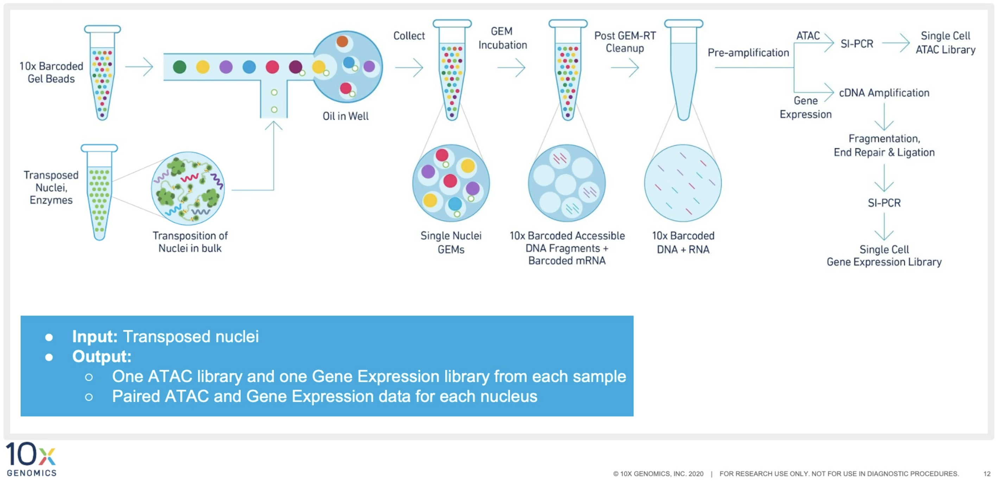

# Multiome profiling with 10X

10X multiome ATAC + Gene Expression kit provides genome-wide profiling of chromatin accessibilities and transcriptome-wide profiling of gene expression at single cell resolution.

## Library preparation

[10X multiome library preparation](https://www.10xgenomics.com/support/single-cell-multiome-atac-plus-gene-expression/documentation/steps/sample-prep) proceeds in 4 stages:

1. **single nuclei isolation** Tissues undergo nuclei isolation using Chromium Nuclei Isolation Kit (optimized for frozen tissues) or other nuclei isolation protocols. Please refer to 10X documentation for guidance, cell lines/PBMCs, complex tissues.
2. **Tn5 Transposation** Tn5 transposase mix is applied to the single nuclei suspension created in the first step to fragment the DNA in the open chromatin regions.
3. **GEM generation and barcoding** Transposed single nuclei suspension are partitioned in emulsion oil that contains gel beads inside Chromium Controller. Within each GEM, DNA and RNA fragments are captured and barcoded. Afterwards, the barcoded DNA and RNA fragments are pre-amplified and splitted to ATAC and gene expression libraries.
4. **Library construction** ATAC and gene expression libraries are generated following separate protocols and sequenced.

<p align="center">
   
  
</p>

<p align="center">
   
  
</p>

The recommended sequencing depth is 25K/nucleus for ATAC libraries, and 20K/nucleus for gene expression libraries.

# Chromatin accessibility profiling with 10X

10x Genomics provides genome-wide profiling of chromatin accessibilities at single cell resolution.

## Library preparation

[scATAC library preparation](https://www.10xgenomics.com/support/single-cell-atac/documentation/steps/sample-prep) occurs in five steps:

1. **single nuclei isolation** Tissues undergo nuclei isolation using Chromium Nuclei Isolation Kit (optimized for frozen tissues) or other nuclei isolation protocols.
2. **Tn5 Transposation** Tn5 transposase mix is applied to the single nuclei suspension created in the first step to fragment the DNA in the open chromatin regions and add Illumina read primer sequences.
3. **GEM generation and barcoding** Transposed single nuclei suspension are partitioned in gel beads, then lysed. DNA fragments are captured and a sequencing primer P5 and a 16 nt 10x (cell) Barcode are added to each fragment. In the same reaction, fragments are amplified.
4. **GEM pooling and cleanup** The DNA from all the gel beads is pooled, and leftover reagents and primers are removed with a magnetic bead purification.
5. **Library construction** Illumina sequencing primer P7 and sample index are added. Completed libraries have both P5 and P7, and are ready for sequencing.

<div class="figure" style="text-align: center">

<p class="caption">The scATACSeq library</p>
</div>


The recommended sequencing depth for single cell ATAC libraries is 25K reads per cell, three orders of magnitude less than the recommended sequencing depth for bulk ATAC libraries.

# Example data set

The data set we will be using in this workshop is an example dataset from [10X](https://www.10xgenomics.com/library/3557ae)

In this study, single nuclei transcriptome and chromatin accessibility profiles were generated from a patient diagnosed with diffuse small lymphocytic lymphoma of the lymph node. The nucleus sequenced are from intra-abdominal lymph node tumor.

For the purposes of this workshop, we are using a subset of this data for data reduction. The full dataset will be used at the data analysis stage.


### Workflow


<div class="figure" style="text-align: center">

</div>


# Data reduction

Log into tadpole and navigate to your directory on the /share/workshop space.

```bash
mkdir -p /share/workshop/scATAC_workshop/$USER
cd /share/workshop/scATAC_workshop/$USER
```
Request an interactive session from the scheduler so that we are not competing for resources on the head node.

```bash
srun -t 1-00:00:00 -c 4 -n 1 --mem 16000 --partition production --account workshop --reservation scworkshop  --pty /bin/bash
```

## Project set-up

### Reads

```bash
mkdir -p /share/workshop/scATAC_workshop/$USER/00-RawData
cd /share/workshop/scATAC_workshop/$USER/00-RawData
ln -s /share/workshop/scATAC_workshop/Data/*.fastq.gz .
```
### Software

Before getting started, we need to make sure that we have the cellranger-atac software in our path. This can be done one of three ways:

1. Module load: `module load cellranger`. This will only work on a cluster with modules for software management.
2. Add the location of a previously downloaded cellranger build to our path: `export PATH=/share/workshop/scRNA_workshop/software/cellranger-atac.2.1.0/bin:$PATH`. This will not work if you don't have a copy of cellranger somewhere on the system.
3. Download cellranger-atac in the current directory:

```bash
wget -O cellranger-atac-2.1.0.tar.gz "https://cf.10xgenomics.com/releases/cell-atac/cellranger-atac-2.1.0.tar.gz?Expires=1658147185&Policy=eyJTdGF0ZW1lbnQiOlt7IlJlc291cmNlIjoiaHR0cHM6Ly9jZi4xMHhnZW5vbWljcy5jb20vcmVsZWFzZXMvY2VsbC1hdGFjL2NlbGxyYW5nZXItYXRhYy0yLjEuMC50YXIuZ3oiLCJDb25kaXRpb24iOnsiRGF0ZUxlc3NUaGFuIjp7IkFXUzpFcG9jaFRpbWUiOjE2NTgxNDcxODV9fX1dfQ__&Signature=jbfFoycsgaQ1gvDsz7-7gerjd9cW1YqTgSjS7XT8hQzIqTLPunC6YbblGiYTkOlF6tzlpAfvy78ntmf7T0NbMkm~hdrFxZXa-nya0JqIdewj8v4jwaEL7b9OikhzcutA6li2agcHUXKz89Ilx99Z-OMo~mmM-4NPvWitmgalmxRT5tBXZ~MqDYeScnIpGz-6BfKPqRN6EoIzEiLBOW2jrgcADkiotPM13qL-5h-gW6cdw46sF93lWt5-hrWTooUac2ao1BzVMTzdA4IN9To0SFGjZ0oCTp~HS-q9aqpZZ8Od1AXX56dhBVxtKe023HDE~2OIN7i4Baql88NBTZVHXA__&Key-Pair-Id=APKAI7S6A5RYOXBWRPDA"
```

### Reference

There are prebuilt human and mouse reference packages for use with Cell Ranger ATAC, which we will be using in this workshop. For other species, or to create a custom reference, one can use *cellranger-atac mkref*.

#### cellranger-atac mkref

* Reference genome fasta (single species, primary assembly)
* Annotation gtf
* Optional, transcription factor binding motif in position frequency matrices ([JASPAR](https://jaspar.genereg.net/))

Config file to specify the custom references follows [this example](example.json.txt)


The following code will generate a reference with cellranger-atac mkref. This takes a while, and is not used in this workshop. When using this code, please ensure that your FASTA and GTF files are appropriate versions, downloading up to date files as necessary.

```bash
cd /share/workshop/scATAC_workshop/$USER
cellranger-atac mkref \
   --config=path/to/config
```

Additional instructions for building ATAC references can be found [here](https://support.10xgenomics.com/single-cell-atac/software/release-notes/references#GRCh38-2020-A-2.0.0).

#### Downloading prebuilt Cell Ranger reference

Since we are working with human data in this workshop, let's download the prebuilt reference.

```bash
cd /share/workshop/scATAC_workshop/$USER/
curl -O https://cf.10xgenomics.com/supp/cell-atac/refdata-cellranger-arc-GRCh38-2020-A-2.0.0.tar.gz
tar -xzvf refdata-cellranger-arc-GRCh38-2020-A-2.0.0.tar.gz
rm refdata-cellranger-arc-GRCh38-2020-A-2.0.0.tar.gz
```

## Running cellranger-atac count

For experiments with ATAC libraries only, 10x recommends running `cellranger-atac count`, while `cellranger-arc count` allows gene expression, and ATAC libraries from the same experiment to be processed simultaneously. Detailed descriptions of [cellranger-arc count](https://support.10xgenomics.com/single-cell-multiome-atac-gex/software/pipelines/latest/using/count#count) and [cellranger-arc](https://support.10xgenomics.com/single-cell-multiome-atac-gex/software/pipelines/latest/what-is-cell-ranger-arc) can be found on the 10x website.

### Input

The call to cellranger-atac count is simple:

```bash
cellranger-atac count \
    --id=sampleID \
    --fastqs=00-RawData \
    --sample=sampleID \
    --reference=refdata-cellranger-arc-GRCh38-2020-A-2.0.0
```

### Output

There are a *lot* of files created in the output folder, including:

* web_summary.html - similar to gene expression
* summary.csv - similar to gene expression
* filtered_peak_bc_matrix - similar to gene expression
* filtered_tf_bc_matrix - similar to gene expression
* peak_annotation.tsv
* fragments.tsv.gz - peak barcode table
* singlecell.csv - barcodes summary
* BAMs - alignment files

## Running cellranger-atac aggr

*cellranger-atac aggr* provides one option of analyzing multiple scATAC-Seq datasets, with limited types of analyses. What it takes is a config file that specifies the *fragments.tsv.gz* and *singlecell.csv* results from each dataset.

```
library_id,fragments,cells
A001-C-007,A001-C-007/outs/fragments.tsv.gz,A001-C-007/outs/singlecell.csv
A001-C-104,A001-C-104/outs/fragments.tsv.gz,A001-C-104/outs/singlecell.csv
B001-A-301,B001-A-301/outs/fragments.tsv.gz,B001-A-301/outs/singlecell.csv
```


```bash
cellranger-atac aggr \
  --id=combined \
  --csv=config.csv \
  --reference=refdata-cellranger-arc-GRCh38-2020-A-2.0.0 \
  --localcores=4 \
  --normalize=none \
  --dim-reduce=lsa \
  --localmem=4
```

The results for the full dataset is in /share/workshop/scATAC_workshop/cellranger.outs/

On your local laptop/desktop, please create a project directory where you will do the rest of the analysis in. Please download the fragments.tsv.gz to your local laptop and keep the data structure. For example, having a directory structure like A001-C-007/outs/fragments.tsv.gz.


### Download the analysis Rmd file for the next section

```
wget https://raw.githubusercontent.com/ucdavis-bioinformatics-training/2022-July-Advanced-Topics-in-Single-Cell-RNA-Seq-ATAC/main/data_analysis/scATAC_analysis.Rmd
```


